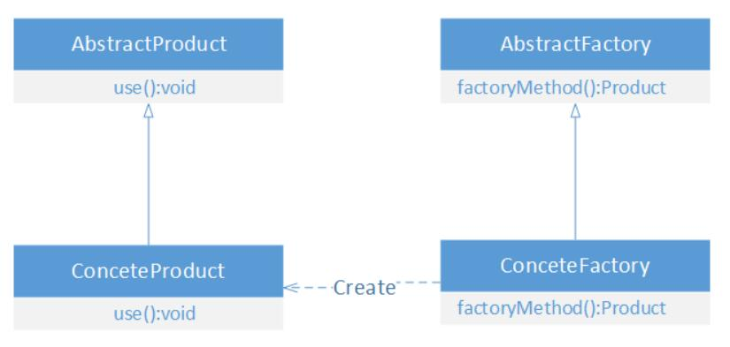
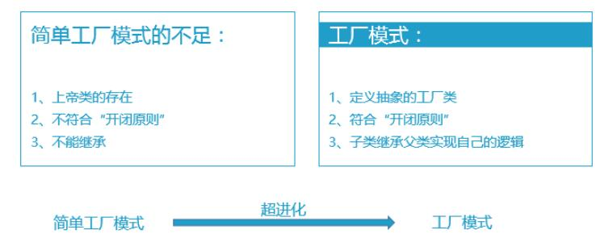
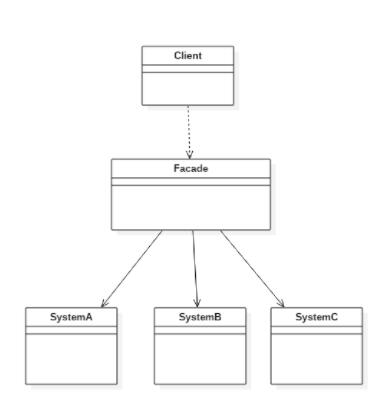

<p align='center'>
<a href="https://github.com/satoshiSchubert" target="_blank"></a>


# Notebook for Design Patterns
---
相关资源：

- Alberta大学Coursera网课对应课堂笔记：<br/>[Updated-C2 Course Notes(2).pdf](https://d3c33hcgiwev3.cloudfront.net/44JLpgAbSc-CS6YAG9nPIQ_75f1eaeb36664140867f933cd9cf4cf1_Updated--C2-Course-Notes-2-.pdf?Expires=1640476800&Signature=cMCc2cSI1W9NeX4pivcl4RHwSzBjwQguw7mON-SeZNN~PdMC-NZjnguxgNZtL11zaiH0mFMjhsXL-fpY1Sac82jowuB6HO9O~~HfesBnhsAgu0lVxxr3cUBMyp73TKDPvoHQ-cahu079ssNZzxdsJJGZx779kQAHG~p-dTUbkAc_&Key-Pair-Id=APKAJLTNE6QMUY6HBC5A)
- CSDN上一个比较不错的博主：<br/>https://blog.csdn.net/xingjiarong/category_5974783.html

< --! INSERT CATALOGUE HERE !-- >

## Module1: Introduction to Design Patterns:Creational and Structural Patterns

设计模式一共有24种，可以被分成三大类，分别是 **creational patterns**, **structural patterns**, and **behavioral patterns**

**创建型模式，creational patterns**

创建型模式提供了一种**在创建对象的同时隐藏创建逻辑**的方式，而不是使用 new 运算符直接实例化对象。这使得程序在判断针对某个给定实例需要创建哪些对象时更加灵活。包括：

- 工厂模式（Factory Pattern）
- 抽象工厂模式（Abstract Factory Pattern）
- 单例模式（Singleton Pattern）
- 建造者模式（Builder Pattern）
- 原型模式（Prototype Pattern）

创建型模式还取决于编程语言。对于没有classes的语言，比如JavaScript，一般都是clone原来的object，然后对其进行拓展，使其符合特定要求，而原来的object就称为prototype。对于有classes的语言，比如cpp和java，则是在编译阶段使用特定的类来初始化。

**结构型模式，structural patterns**

结构型模式描述objects之间是如何互相连接的。结构性设计模式关注类和对象的组合。继承的概念被用来组合接口和定义组合对象获得新功能的方式。

- 适配器模式（Adapter Pattern）
- 桥接模式（Bridge Pattern）
- 过滤器模式（Filter、Criteria Pattern）
- 组合模式（Composite Pattern）
- 装饰器模式（Decorator Pattern）
- 外观模式（Facade Pattern）
- 享元模式（Flyweight Pattern）
- 代理模式（Proxy Pattern）

**行为型模式，behavioral patterns**

行为型设计模式特别关注对象之间的通信。行为型模式涉及到算法和对象间职责的分配。行为模式不仅描述对象或类的模式，还描述它们之间的通信模式。这些模式刻划了在运行时难以跟踪的复杂的控制流。它们将你的注意力从控制流转移到对象间的联系方式上来。

行为类模式使用继承机制在类间分派行为。
行为对象模式使用对象复合而不是继承。描述一组对等的对象怎样相互协作以完成任一个对象都无法完成的任务。

- 责任链模式（Chain of Responsibility Pattern）
- 命令模式（Command Pattern）
- 解释器模式（Interpreter Pattern）
- 迭代器模式（Iterator Pattern）
- 中介者模式（Mediator Pattern）
- 备忘录模式（Memento Pattern）
- 观察者模式（Observer Pattern）
- 状态模式（State Pattern）
- 空对象模式（Null Object Pattern）
- 策略模式（Strategy Pattern）
- 模板模式（Template Pattern）
- 访问者模式（Visitor Pattern）

### Singleton Pattern, 单例模式

单例模式是创建型模式的一种。他的关键在于单例模式中在所有情况下都有且仅有一个独一无二的类被构建，这样就可以避免多次构建产生版本冲突，而且可以保证这个类的一致性。

单例模式的另一个目标是这个类是可以全局被访问的。

单例模式实现的关键在于，如何把一个类的构造函数给包装起来，使得可以达到以下效果：<br/>
1. 如果这个类还没被创建，调用`getInstance()`后，创建这个类；
2. 如果这个类之前已经被创建过了，调用`getInstance()`后，直接返回之前创建的类
3. 外部只能通过`getInstance()`来进行类的构造操作
  
这样就可以保证全局上有且仅有一个类被构建了。

下面实现的是常用的三种，分别是懒汉式、饿汉式和多线程式。

**懒汉式**

特点是延迟加载

```cpp
class ExampleSingleton{
	// lazy construction
	// the class variable is null if no instance is instantiated
private:
	//TODO:这里是否可以理解成类本身在创建时已经是构造好的，但是和外界进行交互的实际上是这个类里边存的一个新的类指针，而这个类指针uniqueInstance在构造时实际上是没有赋值的。
	static ExampleSingleton* uniqueInstance = NULL;
	ExampleSingleton(){ cout<<"CONSTRUCTED"; }
	
public:
	ExampleSingleton* getInstance(){
		if(uniqueInstance == NULL)
			uniqueInstance = new ExampleSingleton();
		return uniqueInstance;
	}
};
```

**饿汉式**

和懒汉相反，以空间换时间，提前加载。

```cpp
class ExampleSingleton{
private:
	ExampleSingleton(){}
public:
	ExampleSingleton* getInstance(){
		static ExampleSingleton instance;
		return &instance;
	}
}
```
饿汉式是线程安全的,在类创建的同时就已经创建好一个静态的对象供系统使用,以后不再改变，懒汉式如果在创建实例对象时不加上synchronized则会导致对对象的访问不是线程安全的。线程安全的通俗解释 - 不管多个线程是怎样的执行顺序和优先级,或是wait,sleep,join等控制方式，如果一个类在多线程访问下运转一切正常，并且访问类不需要进行额外的同步处理或者协调，那么我们就认为它是线程安全的。 线程安全的类应当封装了所有必要的同步操作，调用者无需额外的同步。还有一点：无状态的类永远是线程安全的。

在饿汉式的单例类中，其实有两个状态，单例未初始化和单例已经初始化。假设单例还未初始化，有两个线程同时调用GetInstance方法，这时执行 `m_pInstance == NULL` 肯定为真，然后两个线程都初始化一个单例，最后得到的指针并不是指向同一个地方，不满足单例类的定义了，所以饿汉式的写法会出现线程安全的问题！在多线程环境下，要对其进行修改。

**多线程式**

对懒汉模式进行处理：

```cpp
class ExampleSingleton{
private:
	static ExampleSingleton* uniqueInstance = NULL;
	ExampleSingleton(){}
	
public:
	ExampleSingleton* getInstance();
};

ExampleSingleton* ExampleSingleton::getInstance(){
	if(uniqueInstance == NULL)
	{
		Lock();//借用其他类实现进程锁
		if(uniqueInstance == NULL)
		{
			uniqueInstance = new ExampleSingleton();
		}
		UnLock();
	}
	return uniqueInstance;
}
```

使用double-check来保证thread safety.但是如果处理大量数据时，该锁会成为严重的性能瓶颈。


### Factory Method Pattern, 工厂方法模式

ref: https://blog.csdn.net/xingjiarong/article/details/50001387

先从简单工厂模式入手。

**SimpleFactory Patterns**

简单工厂模式实际上并不是一个设计模式。 

解决的问题：将“类实例化的操作”与“使用对象的操作”分开，让使用者不用知道具体参数就可以实例化出所需要的“产品”类，从而避免了在客户端代码中显式指定，实现了解耦。即，使用者可直接消费产品而不需要知道其生产的细节。简单工厂模式的核心思想就是：有一个专门的类来负责创建实例的过程。

```cpp
class Car{
	void drive();
}
//创建一个工厂类，这个类专门负责建造各种汽车
class Driver{
public:
	Car car = NULL;

	Car getCar(string type){
		if(type == "Benz")
			car = new Benz();
		else if(type == "Audi")
			car = new Audi();
		else if(type == "BMW")
			car = new BMW();
		return car;
	}
}
//调用时，可以看到，我们只需指定车的种类即可，类的具体初始化被隐藏在工厂类里边了
int main(){
	Car car = Driver.getCar("Audi");
	car.drive();
}
```

优点：

- 将创建实例的工作与使用实例的工作分开，使用者不必关心类对象如何创建，实现了解耦；

缺点：

- 由于工厂类集中了所有产品创建逻辑，工厂类一般被我们称作“全能类”或者“上帝类”，因为所有的产品创建他都能完成，这看似是好事，但仔细想想是有问题的。比如全国上下所有的事情都有国家主义一个人干会不会有问题，当然有！一旦不能正常工作，整个系统都要受到影响。
- 系统扩展困难，一旦添加新产品就不得不修改工厂逻辑，在产品类型较多时，有可能造成工厂逻辑过于复杂，不利于系统的扩展和维护。所以说从工厂的角度来说简单工厂模式是不符合“开-闭”原则的。
- 简单工厂模式由于使用了静态工厂方法，静态方法不能被继承和重写，会造成工厂角色无法形成基于继承的等级结构。

**Factory Method Pattern**

在工厂方法模式中，工厂父类负责定义创建产品对象的公共接口，而工厂子类则负责生成具体的产品对象，这样做的目的是将产品类的实例化操作延迟到工厂子类中完成，即通过工厂子类来确定究竟应该实例化哪一个具体产品类。



我们可以看到工厂方法模式一共分为四个部分：

- 抽象工厂（AbstractCreator）角色：担任这个角色的是工厂方法模式的核心，它是与应用程序无关的。任何在模式中创建对象的工厂类必须继承或者实现这个接口，在实际的系统中，这个角色常常有Java抽象类来实现。
- 具体工厂（ConcreteCreator）角色：担任这个角色的是实现了抽象工厂接口的具体Java类。具体工厂角色含有与应用密切相关的逻辑，并且受到应用程序的调用以创建产品对象。
- 抽象产品（AbstractProduct）角色：工厂方法模式所创建的对象的超类型，也就是产品对象的共同父类或共同拥有的接口。在实际应用中这个角色常常由Java的抽象类来实现。
- 具体产品（ConcreteProduct）角色：这个角色实现了抽象产品角色所声明的接口，工厂方法所创建的每一个对象都是某个具体产品角色的实例。

动机：

1. 解决简单工厂模式中存在的“上帝类”的问题，将具体的生产任务放到子类中去。
2. 解决简单工厂模式工厂角度不符合“开-闭”原则的问题。
3. 解决简单工厂模式不能使用继承的问题。



对于上面简单工厂所对应的类，可以发现以下问题：

1. 如果后来新增很多车，那么这个Driver(工厂类)会变得很大，有很多的if else判断语句
2. 这个Driver类一旦出了一点问题，就全部崩了
   
如下改进：


```cpp
//首先，定义一个抽象的工厂类(Driver)，这个抽象工厂类中有定义好的抽象方法getCar()；用来告诉具体的工厂如何来获得汽车
class Driver{
public:
	Car getCar();
}

//然后，每一种车都配一个专门的司机，这个司机只负责或者一种车
//其他车型也如法炮制，这里不再重复
class BenzDriver : public Driver{
public:
	Car car = NULL;
	Car getCar(){
		car = new Benz();
		return car; 
	}
}

//在客户端中，创建对应的Driver类，让特定的Driver来生产特定的汽车。

int main(){
	// 奔驰车司机（用户只关心奔驰车所对应的工厂）
	Driver driver = new BenzDriver(); 
	// 今天坐奔驰车(具体生产出汽车)
	Car car = driver.getCar();
	// 开车
	car.drive();
}
```

优点：

- 在工厂方法模式中，工厂方法用来创建客户所需要的产品，同时还向客户隐藏了哪种具体产品类将被实例化这一细节，**用户只需要关心所需产品对应的工厂**，无须关心创建细节，甚至无须知道具体产品类的类名。
- 基于工厂角色和产品角色的多态性设计是工厂方法模式的关键。它能够使工厂可以自主确定创建何种产品对象，而如何创建这个对象的细节则完全封装在具体工厂内部。工厂方法模式之所以又被称为多态工厂模式，是因为所有的具体工厂类都具有同一抽象父类。
- 使用工厂方法模式的另一个优点是在系统中加入新产品时，无须修改抽象工厂和抽象产品提供的接口，无须修改客户端，也无须修改其他的具体工厂和具体产品，而只要添加一个具体工厂和具体产品就可以了。这样，系统的可扩展性也就变得非常好，完全符合“开闭原则”。

缺点：

- 在添加新产品时，需要编写新的具体产品类，而且还要提供与之对应的具体工厂类，系统中类的个数将成对增加，在一定程度上增加了系统的复杂度，有更多的类需要编译和运行，会给系统带来一些额外的开销。
- 由于考虑到系统的可扩展性，需要引入抽象层，在客户端代码中均使用抽象层进行定义，增加了系统的抽象性和理解难度，且在实现时可能需要用到DOM、反射等技术，增加了系统的实现难度。


### Facade Pattern, 外观模式

门面模式(Facade Pattern)：外部与一个子系统的通信必须通过一个统一的外观对象进行，为子系统中的一组接口提供一个一致的界面，外观模式定义了一个高层接口，这个接口使得这一子系统更加容易使用。门面模式又称为外观模式，它是一种对象结构型模式。

说白了，就是类似写一个前端，方便用户对其进行操作，而不用管内部的复杂逻辑

使用前：


使用后


模式结构
 
 

举例说明：<br>
比如，有一个土豪，回家之后想要开灯，然后开热水器洗澡，然后看电视，传统情况下每个事件都是一个类，都有一个open()操作，那么完成上述三个动作就要构建3个类，调用三次open()。

这时候如果我们使用门面模式：

```cpp
class Facade{
private:
	Light light1, light2, light3;
	Heater heater;
	TV tv;

public:
	Facade(){
		light1 = new Light();
		light2 = new Light();
		light3 = new Light();
		heater = new Heater();
		tv = new TV();
	}

	void open({
		light1.open();
		light2.open();
		light3.open();
		Heater.open();
		TV.open();
	})
}
// 这样，主函数只要使用这个Facade就可以了
// 有一说一，感觉就是一个很简单的wrapper。。。
int main(){
	Facade facade = new Facade();
	facade.open();
}
```


