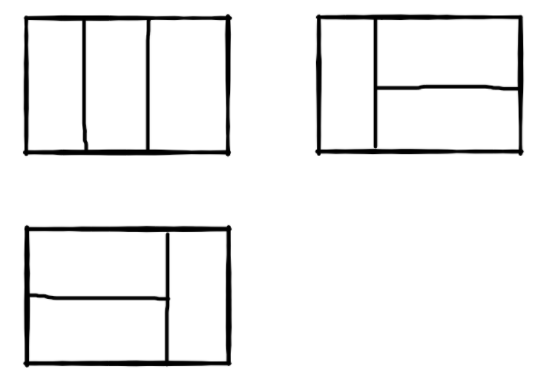

<p align='center'>
<a href="https://github.com/satoshiSchubert" target="_blank"></a>


### Problems to be solve:
[并查集，洛谷P1551](https://zhuanlan.zhihu.com/p/93647900/)
[剑指offer](https://github.com/gatieme/CodingInterviews)


# Notebook for Algorithm Ploblems
---
分类参考：
https://books.halfrost.com/leetcode/ChapterTwo/Linked_List/

### 目录：

  - [0. TEMPLATE]()
  - [NC61 两数之和](#nc61-两数之和)
  - [JZ40 最小的K个数](#jz40-最小的k个数)
  - [JZ30 包含min函数的栈](#jz30-包含min函数的栈)
  - [JZ35 复杂链表的复制](#jz35-复杂链表的复制)
  - [JZ31 栈的压入、弹出序列](#jz31-栈的压入弹出序列)
  - [105. Construct Binary Tree from Preorder and Inorder Traversal](#105-construct-binary-tree-from-preorder-and-inorder-traversal)
  - [114. Flatten Binary Tree to Linked List](#114-flatten-binary-tree-to-linked-list)
  - [110. Balanced Binary Tree](#110-balanced-binary-tree)
  - [2. Add Two Numbers](#2-add-two-numbers)
  - [82. Remove Duplicates from Sorted List II](#82-remove-duplicates-from-sorted-list-ii)
  - [99. Recover Binary Search Tree](#99-recover-binary-search-tree)
  - [341. Flatten Nested List Iterator](#341-flatten-nested-list-iterator)
  - [P1014.Cantor表](#p1014-noip1999-普及组-cantor-表)

---

### 0. TEMPLATE
https://links_to_the_ploblem.com

date: 20xx/xx/xx


```cpp
SOLUTION!
```

comment:<br>
你的心得blablabla

### NC61 两数之和
https://www.nowcoder.com/practice/20ef0972485e41019e39543e8e895b7f?tpId=117&&tqId=37756&rp=1&ru=/activity/oj&qru=/ta/job-code-high/question-ranking

date: 2021/10/19

```cpp
vector<int> twoSum(vector<int>& numbers, int target) {
        // write code here
        unordered_map<int, int> m;
        for(int i=0; i< numbers.size(); i++){
            if(m.find(target - numbers[i]) != m.end())
                //没找到：返回unordered_map::end
                return{m[target-numbers[i]], i+1};
            m[numbers[i]] = i+1;
        }
        return{-1,-1};
    }
```

comment:<br>
绝了，用hash map来做

### JZ40 最小的K个数
https://www.nowcoder.com/practice/6a296eb82cf844ca8539b57c23e6e9bf?tpId=13&tqId=23263&ru=/ta/sql-quick-study&qru=/ta/sql-quick-study/question-ranking

date: 2021/10/18


```cpp
class Solution {
public:
    vector<int> GetLeastNumbers_Solution(vector<int> input, int k) {
        vector<int> output;
        output = SelectSort(input, k);
        output = QuickSort(input, k);
        output = MinHeap(input, k);
        
        
        return output;
    }
    //选择排序
    vector<int> SelectSort(vector<int> input, int k){
        int min = input[0];
        int temp, i, count;
        for(count=0;count<k;count++){
            for(i=count+1;i<input.size();i++){
                if(input[i]<input[count]){
                    temp = input[count];
                    input[count] = input[i];
                    input[i] = temp;
                }
            }
        }
        vector<int> out(&input[0],&input[k]);
        return out;
    }
    // 快排
    vector<int> QuickSort(vector<int> input, int k){
        sort(input.begin(),input.end());
        vector<int> out;
        for(int i=0;i<k;i++){
            out.push_back(input[i]);
        }
        return out;
    }
    // 最小堆
    vector<int> MinHeap(vector<int> input, int k){
        vector<int> res;
        if(!input.size()||input.size()<k) return res;
        // less<int>() 是大顶堆，greater<int>() 是小顶堆，默认大顶堆
        make_heap(input.begin(),input.end(),greater<int>());
        for(int i=0;i<k;i++){
            //最小的元素在堆顶
            res.push_back(input[0]);
            //以下两个方法均可：
            //1.清除它，然后重新建立堆：
            //(疑问：sort_heap一次之后堆应该就无效了，不如直接sort完取前k个)
            //input.erase(input.begin());
            //sort_heap(input.begin(),input.end());
            //2.或者直接从堆中弹出这个元素，用堆的弹出函数
            pop_heap(input.begin(),input.end(),greater<int>());
            input.pop_back(); //vector删除末尾元素(前面的堆已经默认最后的元素被删了)
        }
        return res;
    }
};
```

comment:<br>
三种方式：选择排序，快速排序和最小堆（最小堆感觉挺神奇的）<br>
最小堆的使用：https://www.cnblogs.com/woxiaosade/p/10628388.html


### JZ70 矩形覆盖
https://www.nowcoder.com/practice/72a5a919508a4251859fb2cfb987a0e6?tpId=13&tqId=23283&ru=/ta/sql-quick-study&qru=/ta/sql-quick-study/question-ranking

date: 2021/10/17

我们可以用2*1的小矩形横着或者竖着去覆盖更大的矩形。请问用n个2*1的小矩形无重叠地覆盖一个2*n的大矩形，从同一个方向看总共有多少种不同的方法？<br>
比如n=3时，2*3的矩形块有3种不同的覆盖方法(从同一个方向看)：<br>


```cpp
class Solution {
public:
    int rectCover(int number) {
        /*
        动态规划：
        n = 1:1种
        只能竖着放；
        n = 2：2种
        =和||，两种方式，这两种将作为接下来的基础
        n = 3：3=1+2种
        当最左边选择=时，余下n=1--->1种
        当最左边选择|时，余下n=2--->2种
        n = 4:5=2+3
        当最左边选择=时，余下n=2--->2种
        当最左边选择|时，余下n=3--->3种
        **类似斐波那契数列**
        */
        if(number<=2) return number;
        int prev = 2;
        int post = 1;
        int temp;
        while(number-2){
            temp = prev+post;
            post = prev;
            prev = temp;
            number--;
        }return prev;
        
        
    }
};
```
comment:<br>
有点像找规律。。推出前面的关系，后边的决策和前边有关，这就是动态规划的思想吧

### JZ30 包含min函数的栈
https://www.nowcoder.com/practice/4c776177d2c04c2494f2555c9fcc1e49?tpId=13&tqId=23268&ru=/ta/sql-quick-study&qru=/ta/sql-quick-study/question-ranking

date: 2021/10/17


```cpp
    stack<int> stk;
    stack<int> minHelper;
    
    void push(int value) {
        stk.push(value);
        if(!minHelper.size() || value <= minHelper.top()){
            minHelper.push(value);
        }
    }
    void pop() {
        if(stk.top() == minHelper.top()){
            stk.pop();
            minHelper.pop();
        }else{
            stk.pop();
        }
    }
        int min() {
        return minHelper.top();
    }
```

comment:<br>
 看到这个问题, 我们最开始可能会想, 添加一个成员变量用于保存最小元素, 每次压栈时如果压栈元素比当前最小元素更小, 就更新最小元素. 
 但是这样会有一个问题, 如果最小元素被弹出了呢, 如何获得下一个最小元素呢? 分析到这里可以发现, 仅仅添加一个成员变量存放最小元素是不够的, 我们需要在最小元素弹出后还能得到次小元素, 次小的弹出后, 还要能得到次次小的. 
 因此, 用另一个栈来保存这些元素是再合适不过的了. 我们叫它**最小元素栈**. 
 每次压栈操作时, 如果压栈元素比当前最小元素更小, 就把这个元素压入最小元素栈, 原本的最小元素就成了次小元素. 同理, 弹栈时, 如果弹出的元素和最小元素栈的栈顶元素相等, 就把最小元素的栈顶弹出.


### JZ35 复杂链表的复制
https://www.nowcoder.com/practice/f836b2c43afc4b35ad6adc41ec941dba?tpId=13&tqId=23254&ru=/ta/sql-quick-study&qru=/ta/sql-quick-study/question-ranking

date: 2021/10/17

```cpp
/*
*解题思路：
*1、遍历链表，复制每个结点，如复制结点A得到A1，将结点A1插到结点A后面；
*2、重新遍历链表，复制老结点的随机指针给新结点，如A1.random = A.random.next;
*3、拆分链表，将链表拆分为原链表和复制后的链表
*/
class Solution {
public:
    RandomListNode* Clone(RandomListNode* pHead) {
        if(!pHead) return NULL;
        
        RandomListNode* currentNode = pHead;
        //1、复制每个结点，如复制结点A得到A1，将结点A1插到结点A后面；
        while(currentNode != NULL){
            RandomListNode* cloneNode = new RandomListNode(currentNode->label);
            RandomListNode* nextNode = currentNode->next;
            currentNode->next = cloneNode;
            cloneNode->next = nextNode;
            currentNode = nextNode;
        }
        currentNode = pHead;
        
        //2、重新遍历链表，复制老结点的随机指针给新结点，如A1.random = A.random.next;
        while(currentNode != NULL){
            currentNode->next->random = currentNode->random==NULL?NULL:currentNode->random->next; //妙啊
            currentNode = currentNode->next->next;
        }
        
        currentNode = pHead;
        RandomListNode* pCloneHead = pHead->next;

        //3、拆分链表，将链表拆分为原链表和复制后的链表
        while(currentNode){
            RandomListNode* cloneNode = currentNode->next;
            currentNode->next = cloneNode->next;
            cloneNode->next = cloneNode->next==NULL?NULL:cloneNode->next->next;
            currentNode = currentNode->next;
        }
        
        return pCloneHead;
        
    }
};

```

comment:<br>


### JZ31 栈的压入、弹出序列
https://www.nowcoder.com/practice/d77d11405cc7470d82554cb392585106?tpId=13&tqId=23290&ru=/ta/sql-quick-study&qru=/ta/sql-quick-study/question-ranking

date: 2021/10/06
```cpp
class Solution {
public:
    bool IsPopOrder(vector<int> pushV,vector<int> popV) {
        stack<int> temp;
        int i=0,j=0;
        while(i<pushV.size()){
            temp.push(pushV[i]);
            while(temp.size()&&temp.top()==popV[j]){
                j++;
                temp.pop();
            }
            i++;
        }
        if(!temp.size()) return true;
        return false;
    }
};
```
comment:<br>
之前一直把栈的输入输出原则搞错了。。实际上，栈并不是一定要满了才取出最顶上的元素，随时都可以取出，只要满足FILO即可，因此对于输入序列[1,2,3,4,5]，可以有[3,5,4,2,1]的输出顺序：[1]->[1,2]->[1,2,3]->[1,2]3->[1,2,4]3->[1,2,4,5]3->[1,2,4]3,5->[1,2]3,5,4->[]3,5,4,2,1<br>
解题思路之一可以是模仿这一过程，借用一个辅助的栈，遍历压栈顺序，先讲第一个放入栈中，这里是1，然后判断栈顶元素是不是出栈顺序的第一个元素，这里是4，很显然1≠4，所以我们继续压栈，直到相等以后开始出栈，出栈一个元素，则将出栈顺序向后移动一位，直到不相等，这样循环等压栈顺序遍历完成，如果辅助栈还不为空，说明弹出序列不是该栈的弹出顺序。举例：入栈1,2,3,4,5 出栈4,5,3,2,1 首先1入辅助栈，此时栈顶1≠4，继续入栈2 此时栈顶2≠4，继续入栈3 此时栈顶3≠4，继续入栈4 此时栈顶4＝4，出栈4，弹出序列向后一位，此时为5，,辅助栈里面是1,2,3此时栈顶3≠5，继续入栈5此时栈顶5=5，出栈5, 弹出序列向后一位，此时为3，,辅助栈里面是1,2,3….依次执行，最后辅助栈为空。如果不为空说明弹出序列不是该栈的弹出顺序。

### 105. Construct Binary Tree from Preorder and Inorder Traversal
[https://links_to_the_ploblem.com](https://leetcode.com/problems/construct-binary-tree-from-preorder-and-inorder-traversal/solution/)

date: 2021/10/16

```cpp
class Solution {
public:
    TreeNode* buildTree(vector<int>& preorder, vector<int>& inorder) {
        int rootIdx = 0;
        return build(preorder, inorder, rootIdx, 0, inorder.size()-1);
    }
    
    TreeNode* build(vector<int>& preorder, vector<int>& inorder, int& rootIdx, int left, int right) {
        if (left > right) return NULL;
        int pivot = left;  // find the root from inorder
        while(inorder[pivot] != preorder[rootIdx]) pivot++;
        
        rootIdx++;
        TreeNode* newNode = new TreeNode(inorder[pivot]);
        newNode->left = build(preorder, inorder, rootIdx, left, pivot-1);
        newNode->right = build(preorder, inorder, rootIdx, pivot+1, right);
        return newNode;
    }
};
```

comment:<br>
前序中序重建二叉树<br>
https://leetcode.com/problems/construct-binary-tree-from-preorder-and-inorder-traversal/discuss/340504/C%2B%2B-simple-recursive-(%2B-detail-explanation)


### 114. Flatten Binary Tree to Linked List
https://leetcode.com/problems/flatten-binary-tree-to-linked-list/

date: 2021/10/12


```cpp
class Solution {
public:
    TreeNode* prev=NULL;
    
    void flatten(TreeNode* root) {
        /*
        一个想法是，对树进行先序遍历，然后把遍历的历史记录下来，再make一颗对应的树。但是这种方法很傻；
        考虑到先序递归的节点遍历顺序是1 2 3 4 5 6，那么将其reverse，期待能够有6 5 4 3 2 1的遍历顺序，
        再相应地将他们的left设为Null，right设为前一个节点即可。
        抽象思考一下，就像是一根弹性绳被拉到最末端，然后再逐节处理回来
        */
        
        if(root==NULL) return;
        
        flatten(root->right);
        flatten(root->left); 
        
        //Let's do something
        root->left = NULL;
        root->right = prev; //这里prev的赋值是递归的关键
        prev = root;
        
    }
};
```

comment:<br>
https://leetcode.com/problems/flatten-binary-tree-to-linked-list/discuss/36977/My-short-post-order-traversal-Java-solution-for-share
这题把递归用得好巧妙啊


### 110. Balanced Binary Tree
https://leetcode.com/problems/balanced-binary-tree/

date: 2021/10/09

**二叉树层序遍历标准方法：使用递归（感觉对于树，经常会用到递归呃）**<br>
有两种方法：

1. 根据定义：该节点的左子树高和右子树高相差不大于一；左子树也是平衡二叉树；右子树也是平衡二叉树。不得不说，递归真的妙啊。

```cpp
class Solution {
public:
    int depth(TreeNode* root){
        if(root==NULL) return 0;
        
        int left = depth(root->left);
        int right = depth(root->right);

        return max(left,right) + 1;
        
    }
    
    bool isBalanced(TreeNode* root) {
        
        if(root==NULL) return true;
        int left_depth = depth(root->left);
        int right_depth = depth(root->right);
        
        return abs(left_depth - right_depth)<=1 && isBalanced(root->left) &&  isBalanced(root->right);        
    }
};
```
2. 使用DFS。碰到高度差大于1的直接复制-1，并不断传递到最上层。

```cpp
class solution {
public:
int dfsHeight (TreeNode *root) {
        if (root == NULL) return 0;
        
        int leftHeight = dfsHeight (root -> left);
        if (leftHeight == -1) return -1;
        int rightHeight = dfsHeight (root -> right);
        if (rightHeight == -1) return -1;
        
        if (abs(leftHeight - rightHeight) > 1)  return -1;
        return max (leftHeight, rightHeight) + 1;
    }
    bool isBalanced(TreeNode *root) {
        return dfsHeight (root) != -1;
    }
};
```

comment:<br>
https://leetcode.com/problems/balanced-binary-tree/discuss/35691/The-bottom-up-O(N)-solution-would-be-better


### 2. Add Two Numbers
https://leetcode.com/problems/add-two-numbers/

**[LEETCODE] [Medium] [LinkedList] **

date: 2021/08/14
> description:
> 
> You are given two non-empty linked lists representing two non-negative integers. The digits are stored in reverse order, and each of their nodes contains a single digit. Add the two numbers and return the sum as a linked list.
> You may assume the two numbers do not contain any leading zero, except the number 0 itself.

Example:
```cpp
Input: l1 = [2,4,3], l2 = [5,6,4]
Output: [7,0,8]
Explanation: 342 + 465 = 807.
```
Answer1:
```cpp
/**
 * Definition for singly-linked list.
 * struct ListNode {
 *     int val;
 *     ListNode *next;
 *     ListNode() : val(0), next(nullptr) {}
 *     ListNode(int x) : val(x), next(nullptr) {}
 *     ListNode(int x, ListNode *next) : val(x), next(next) {}
 * };
 */
class Solution {
public:
    ListNode* addTwoNumbers(ListNode* l1, ListNode* l2) {
        /*
        这里有一个小Point，如果要同时新建多个结构体指针，你可以：
        1. ListNode *prev=NULL, *cloneHead=NULL, *clone;或者
        2. ListNode* prev=NULL, *cloneHead=NULL, *clone;也就是第一个prev不用加*，但之后的都要，
        就是不能：
        x. ListNode* prev=NULL, cloneHead=NULL, clone;或者
        x. ListNode* *prev=NULL, *cloneHead=NULL, *clone;这样第一个会变成**
        个人觉得还是1.这样定义比较容易理解一些。
        */
        ListNode *cur1 = l1, *cur2 = l2; //加*代表结构体指针
        ListNode *prev=NULL, *cloneHead=NULL, *clone;
        int s=0, carry=0;
        while(cur1||cur2)
        {
            if(cur1&&cur2){
                s = cur1->val+cur2->val+carry;
            }else if(!cur1){
                s = cur2->val+carry;
            }else{
                s = cur1->val+carry;
            }
            clone = new ListNode(s%10); //s对10取余的值生成一个新结点
            if(s>=10){
                carry = 1; //进位
            }else carry=0;
            
            //接下来就是重要的链接部分了
            if(!cloneHead){
                cloneHead = clone; //若是表头，则直接链接到新生成的clone结点上
                prev = clone; //这里prev指向的是和cloneHead**同一个**new出来的结点，因此后面只需延伸prev即可！
            }else{
                prev->next = clone; //上一步new出来的那个结点的next指向新new出来的结点，创造链接
                prev = clone; //prev指向新结点
            }
            if(cur1) cur1 = cur1->next;
            if(cur2) cur2 = cur2->next;
        }
        if(carry){ //循环之后，如果最后还有carry额外再加一位
            clone = new ListNode(carry);
            prev->next = clone;
            prev = clone;
        }
        prev->next = NULL; //结束链表
        return cloneHead;
        
    }
};
```
Comment:

学完链表之后做（抄）的第一道题，虽然是Medium难度。抄完感觉对linked list的认识加深了，尤其是如何处理新增加结点和原结点之间的链接指向关系。


### P1014 [NOIP1999 普及组] Cantor 表
https://www.luogu.com.cn/problem/P1014

**[LUOGU] [模拟] [枚举，暴力]**

date: 2021/08/14

Answer1:
```cpp
#include <stdio.h>
#include <stdlib.h>
#include "iostream"
using namespace std;
int main(void)
{
	int N, a, b, odd, sum = 0; // a/b
	cin >> N;
	// 可以直接计算N对应的是第几个循环的
	int count = 0;
	while (1) {
		for (int i = 1; i <= N; i++) {
			odd = i % 2; //even=1则从上往下：1/4,2/3,...
			sum = i + 1;
			if (odd) {
				for (int j = 0; j < i; j++) {
					a = 1 + j;
					b = i - j;
					count++;
					if (count == N) {
						cout << b << '/' << a << endl;
						goto outloop;
					}
				}
			}
			else {
				for (int j = 0; j < i; j++) {
					b = 1 + j;
					a = i - j;
					count++;
					if (count == N) {
						cout << b << '/' << a << endl;
					}
				}
			}
		}
	}
outloop:
	system("pause");
	return 0;
}
```
Comment:

是入门难度的题，虽然还是做了挺久。。。题目本身似乎没有什么技巧，只要找到规律模拟就行了。虽然很简单，但是还是贴上来纪念一下，毕竟万事开头难，希望将来能够坚持下去，不要再放弃了。

### 82. Remove Duplicates from Sorted List II
https://leetcode.com/problems/remove-duplicates-from-sorted-list/

**[LEETCODE] [Medium] [LinkedList]**

date: 2021/08/16

>Description:
>
>Given the head of a sorted linked list, delete all nodes that have duplicate numbers, leaving only distinct numbers from the original list. Return the linked list sorted as well.

Example:
```cpp
Input: head = [1,2,3,3,4,4,5]
Output: [1,2,5]
Input: head = [1,1,1,2,3]
Output: [2,3]
```

Answer1:
```cpp
/**
 * Definition for singly-linked list.
 * struct ListNode {
 *     int val;
 *     ListNode *next;
 *     ListNode() : val(0), next(nullptr) {}
 *     ListNode(int x) : val(x), next(nullptr) {}
 *     ListNode(int x, ListNode *next) : val(x), next(next) {}
 * };
 */

class Solution {
public:
    ListNode* deleteDuplicates(ListNode* head) {
        // sentinel Head, 即人为在链表前面添加一个value=0的头，以避免[1，1，1，1]这种edge case.
        ListNode *sentinel = new ListNode(0,head); //包含虚表头的完整链表
        
        // Predecessor = the last node outside the sublist of duplicates
        ListNode *pred = sentinel;
        
        while(head != NULL){
            if(head != NULL && head->next != NULL && head->val == head->next->val)
            {
                while(head != NULL && head->next && head->val == (head->next)->val){
                    head = head->next;
                }
                pred->next = head->next; //注意，这里只是给next赋值，pred本身并没有动，这样即使next是另外一列duplicate也没事
            }else{
                pred = pred->next; //前方没有duplicate，可以前移
            }
            head = head->next; //这一步不放在else里是为了保证3344这种情况不会崩（pred不会在34交汇处就前进）
        }
        return sentinel->next; //这里又忽略了虚表头，这样若输入是[1,1,1]，加入虚表头后[0,1,1,1]，计算完[0,'null']，最终返回则是[‘null] 
    }
    
};
```
comment:

这一题是83题(Remove Duplicates from Sorted List)的加强版本，相较于83题（碰到重复的子列只需保留一个，比如[1,2,3,3,4,4,5]->[1,2,3,4,5]）这一题要求完全删去重复的子列，得到[1,2,5]。这在碰到极端情况时（比如[1,1,1,1]->[]）就特别难处理，用83题的方法时就得考虑很多的if，尤其是表头也属于重复子列的情况。非常丢脸，这道题前后卡了起码两个小时。。。后来还是看了solution。<br/>
Solution中也特意点出了[1，1，1，1]这种edge case，但是它用了一个极为巧妙的方法，就是设定一个 pseudo-head伪表头，值为0且链接指向input的链表的表头，这样就规避了输入样例中[1，1，1，1]这样棘手的情况，具体分析如下： <br/>
sentinel意为哨兵，在这里是一个虚的表头，可以从代码看到它接在input的链表前面<br/>
```cpp
// sentinel Head, 即人为在链表前面添加一个value=0的头，以避免[1，1，1，1]这种edge case.
ListNode *sentinel = new ListNode(0,head); //包含虚表头的完整链表
```
然后也创建了一个pred，代表重复子列前的最新一个结点。（在后面很巧妙的保证了它不会等于重复子列中的元素）
```cpp    
// Predecessor = the last node outside the sublist of duplicates
ListNode *pred = sentinel;
```
在这个while循环中，尤其要注意当head从重复子列出来时，pred只是把它的next连接到head->next，pred结点本身是没有更新的，这样在碰到[1,2,2,4,4]的情况就不会出现pred=4的错误。甚至，由于只是pred->next而不是pred本身改变，在head遍历到NULL时将会自动pred->next = NULL，非常方便。
```cpp
    while(head != NULL && head->next && head->val == (head->next)->val){
        head = head->next;
    }
    pred->next = head->next; //注意，这里只是给next赋值，pred本身并没有动，这样即使next是另外一列duplicate也没事
    }
```

早知道就早点看题解了，浪费了挺多时间的。。。做这些题主要还是熟练链表的操作，下次应该限时。


### 341. Flatten Nested List Iterator
https://leetcode.com/problems/flatten-nested-list-iterator/

**[LEETCODE] [Medium] [stack] [queue]**

date: 2021/08/31

>Description:
>
>You are given a nested list of integers nestedList. Each element is either an integer or a list whose elements may also be integers or other lists. Implement an iterator to flatten it.
>Implement the NestedIterator class:
>NestedIterator(List< NestedInteger > nestedList) Initializes the iterator with the nested list nestedList.
>int next() Returns the next integer in the nested list.
>boolean hasNext() Returns true if there are still some integers in the nested list and false otherwise.

Example:
```cpp
Input: nestedList = [[1,1],2,[1,1]]
Output: [1,1,2,1,1]
Explanation: By calling next repeatedly until hasNext returns false, the order of elements returned by next should be: [1,1,2,1,1].
```

Answer:
```cpp
/**
 * // This is the interface that allows for creating nested lists.
 * // You should not implement it, or speculate about its implementation
 * class NestedInteger {
 *   public:
 *     // Return true if this NestedInteger holds a single integer, rather than a nested list.
 *     bool isInteger() const;
 *
 *     // Return the single integer that this NestedInteger holds, if it holds a single integer
 *     // The result is undefined if this NestedInteger holds a nested list
 *     int getInteger() const;
 *
 *     // Return the nested list that this NestedInteger holds, if it holds a nested list
 *     // The result is undefined if this NestedInteger holds a single integer
 *     const vector<NestedInteger> &getList() const;
 * };
 */

// **这个回答运用了由指针构成的栈** 
class NestedIterator {
private:
    // 这里stack的类型背后要加上 iterator，可能是要强调vector是可迭代的数据类型，否则下面begins和ends没法用 .push() 等操作
    stack<vector<NestedInteger>::iterator> begins, ends; 
public:
    NestedIterator(vector<NestedInteger> &nestedList) {
        begins.push(nestedList.begin()); // 注意，这里的begin和end是一个指针，指向nestedList的起始位置
        ends.push(nestedList.end()); // 这个指针指向终止位置+1！
    }
    
    int next() {
        hasNext(); //如果hasNext = True，那么这一句不会造成什么影响。
        return (begins.top()++)->getInteger(); //这里的顺序是先begins.top()->getInterger返回值,再begins.top()+=1
    }
    
    bool hasNext() {
        while(begins.size()){
            if(begins.top()==ends.top()){ //这里若一层的list循环完了（begin和end位置相等），则脱去当前这一层list嵌套。下面会有进一步解释
                begins.pop();
                ends.pop();
            }else{
                auto x = begins.top(); //这里的auto会根据元素自动为其定义类型
                if(x->isInteger())
                    return true; //脱出该while循环
                
                begins.top()++; //这里的top实际上是一个指针(位置信息)，因此这里是指向的位置+=1
                begins.push(x->getList().begin()); //若指向的是嵌套list，则把这个嵌套list再加载到stack中进行处理
                ends.push(x->getList().end());
            }
        }
        return false;
    }
};

/**
 * Your NestedIterator object will be instantiated and called as such:
 * NestedIterator i(nestedList);
 * while (i.hasNext()) cout << i.next();
 */
```
comment:<br>
这种需要自己构造一个类的题目是第一次碰到，而且他是完全建立在抽象的数据结构之上的，因此第一次着实有点摸不着头脑了。不过看了这个题解之后发现实际上就是根据给定的上一层的抽象数据结构的说明，构造更高一层的、调用前一层的数据类型的一个新数据类型。

举例子来说明这个代码的主要流程：


只能说，脑子还不够灵光，想不到这么抽象的层面啊！

### 99. Recover Binary Search Tree
https://leetcode.com/problems/recover-binary-search-tree/

**[LEETCODE] [Medium] [tree]**

date: 2021/10/08
```cpp
class Solution {
public:
    TreeNode* firstElement = NULL;
    TreeNode* secondElement = NULL;
    TreeNode* prevElement = new TreeNode(INT_MIN);
    int temp;
    
    void recoverTree(TreeNode* root) {
        traverse(root);
        
        temp = firstElement->val;
        firstElement->val = secondElement->val;
        secondElement->val = temp;
    }
    void traverse(TreeNode* root){
        if(!root){
            return;
        }
        traverse(root->left);

        if(!firstElement && prevElement->val > root->val){
            firstElement = prevElement;
        }
        if(firstElement && prevElement->val > root->val){
            secondElement = root;
        }
        prevElement = root;
        
        traverse(root->right);
    }  
};
```
comment:<br>
直接看这个题解，简直无敌：<br>
https://leetcode.com/problems/recover-binary-search-tree/discuss/32535/No-Fancy-Algorithm-just-Simple-and-Powerful-In-Order-Traversal
<br>
需要推一下递归算法排查节点的顺序，就可以理解两个traverse之间的操作了。<br>
不得不说，碰到树的题目时，递归还是爽啊。


### 102. Binary Tree Level Order Traversal
https://leetcode.com/problems/binary-tree-level-order-traversal/

**[LEETCODE] [Medium] [tree]**

date: 2021/10/09
```cpp
class Solution {
public:
    vector<vector<int>> levelOrder(TreeNode* root) {
        queue<TreeNode*> que;
        TreeNode* curr;
        vector<vector<int>> output;
        vector<int> temp;
        
        if(!root) return output;
        
        que.push(root);
        que.push(NULL); //NULL is a marker.
        
        while(!que.empty()){
            
            curr = que.front();
            que.pop();
            
            if(curr!=NULL){
                temp.push_back(curr->val);
                if(curr->left) que.push(curr->left);
                if(curr->right) que.push(curr->right);
            }else{
                output.push_back(temp);
                temp.resize(0); //Clear.
                if(que.size()>0) que.push(NULL); //Iteratively add NULL marker to confine each level.
            }
        }
        return output;
    }
};
```
comment:<br>
层序遍历的核心代码是很简单的，一个queue就行，这里的问题在于如何判断每一层的末尾，这里卡了好久。。。<br>
最后还是看了别人的题解，这里用了一个类似递归的方法：在queue中，先在root后插入一个NULL作为标记，今后扫到这个NULL时（上层扫到NUUL那么下层应该也全部入队完毕了），在queue的末尾插入一个NULL，这样就可以自动重复下去了，只能说很妙。<br>
注意插入NULL时要判断现在的queue是不是已经为空，否则会死循环，因为NULL本身是占据空间的。<br>
PS:甚至不用这个NULL作为marker，直接用queue.size()即可，因为这个信息也是在最初可以直到的。


