

入门视频链接：
1. https://www.bilibili.com/video/BV1G54y1971S?from=search&seid=16113980904456996368&spm_id_from=333.337.0.0
2. https://www.bilibili.com/video/BV1Tf4y1i7Go/?spm_id_from=333.788.recommend_more_video.-1
3. https://www.bilibili.com/video/BV1Tf4y1i7Go/?spm_id_from=autoNext
4. https://www.bilibili.com/video/BV1ta4y1t7EK?from=search&seid=11867558855037378426&spm_id_from=333.337.0.0
5. https://www.bilibili.com/video/BV1T54y1H7Hs/?spm_id_from=333.788.recommend_more_video.6

#### 如何使用卷积的方法把把节点嵌入到特征空间中呢？
- Solution1: Generalize the concept of convolution(corelation) to gragh>>Spatial-based convolution
- Solution2: Back to the definition of convolution in signal processing>>Spectral-based convolution

**Tasks**
- Semi-supervised node classification
- Regression
- Graph classification
- Graph representation learning
- Link prediction
**Common dataset**
- CORA: citation network. 2.7k nodes and 5.4k links
- TU-MUTAG: 188 molecules with 18 nodes on average

#### Spatial-based convolution

##### **NN4G(Neural Network For Graph)** 
每一层是怎么更新的： 
这一步实际上叫做**聚合(aggregation)**
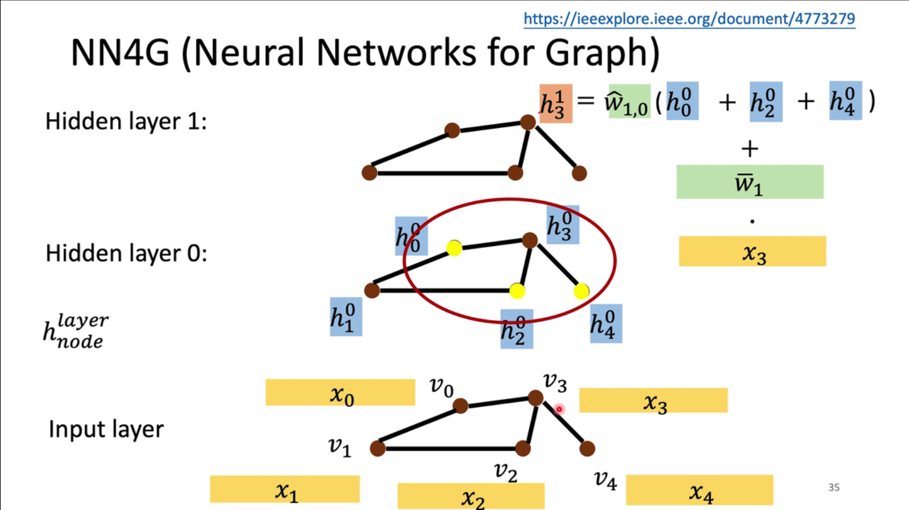 

Readout： 
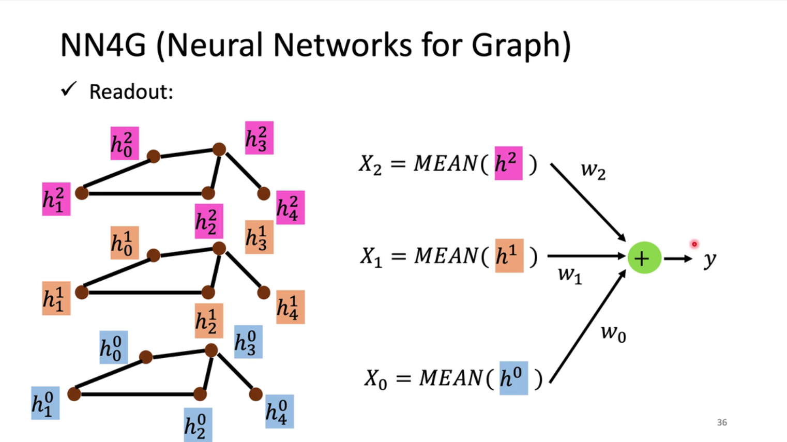 

##### **DCNN(Diffusion-Convolution Neural NEtwork)**
在这个图中，蓝色层和红色层和之后的层的节点数据来源都是初始的黄色层，这里d(3,·) = 1的意思是和3号节点距离为1的所有点，也就是说上标越大，他聚合的就是越远的信息： 
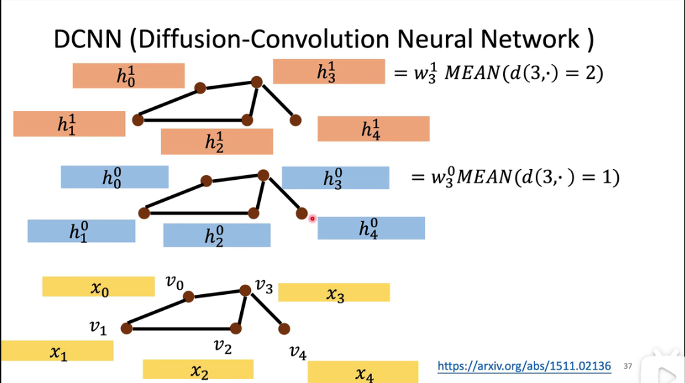 

这样处理K次就可以得到K层的H矩阵，里面包含了每一次的hi的信息： 
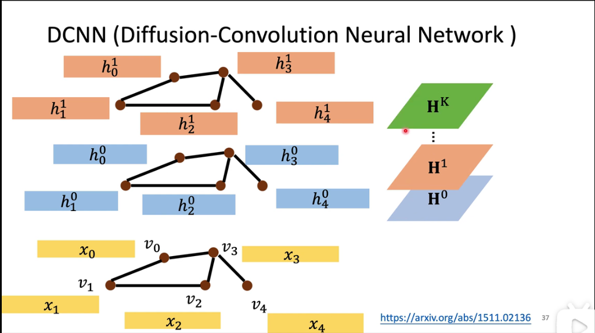 

然后乘以权重，得到节点的feature： 
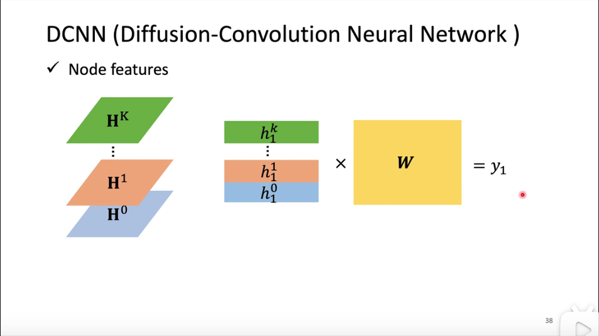 

##### GAT(Graph Attention Network)
https://www.bilibili.com/video/BV1T54y1H7Hs/?spm_id_from=333.788.recommend_more_video.6

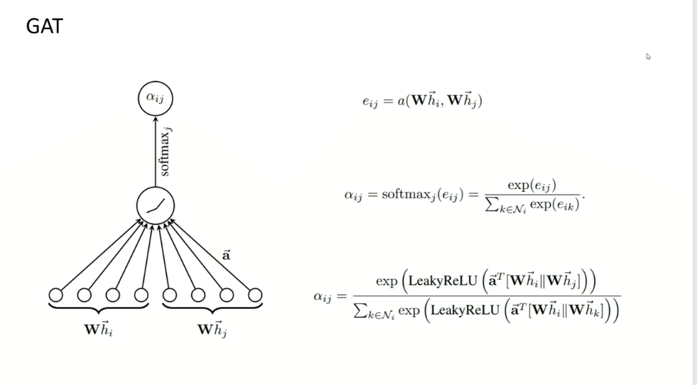

对邻居节点的权重进行学习，做Attention。 
这里用了一个函数f来计算相邻节点之间的权重，或者能量e；
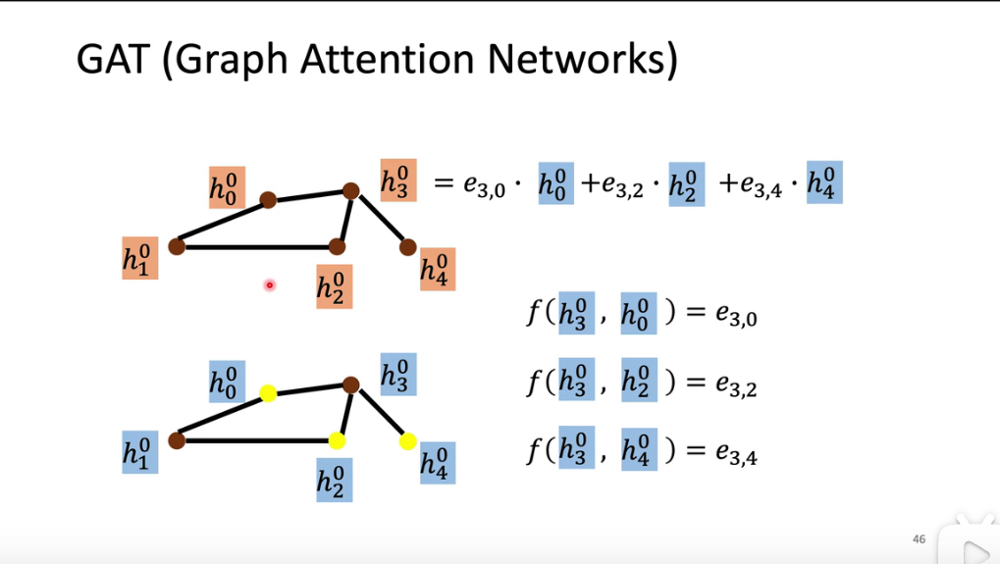 

#### Spectral-based convolution

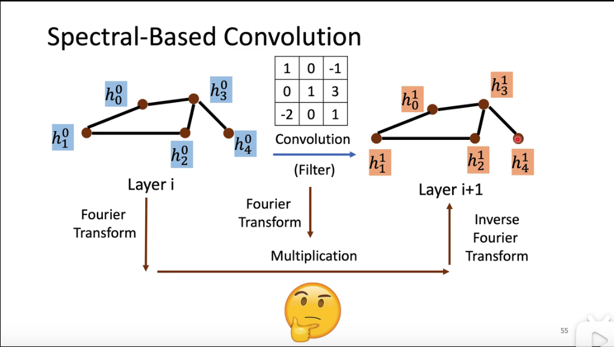

频率越大，相邻两点之间的信号变化就越大

下面的公式实际上是离散微分（拉普拉斯）

$Lf = (D-A)f = Df-Af$

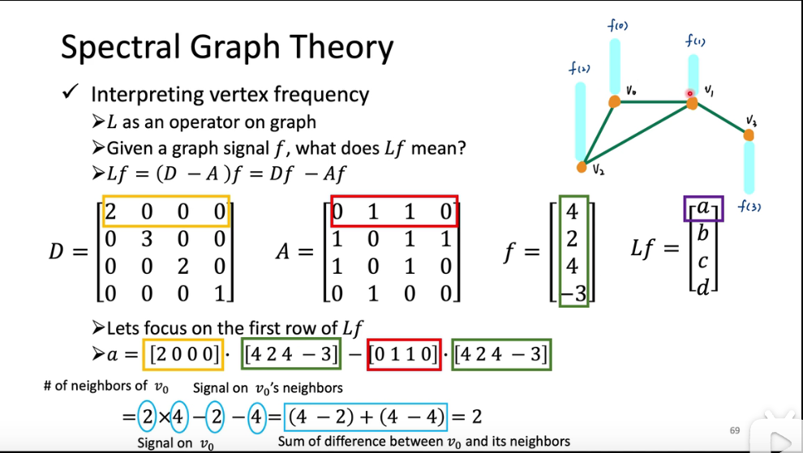

可以看出，Laplacian实际上就是sum of difference between v0 and its neighbors(能量差) 
但是，能量是要通过平方来表示的，也就是$f^TLf$

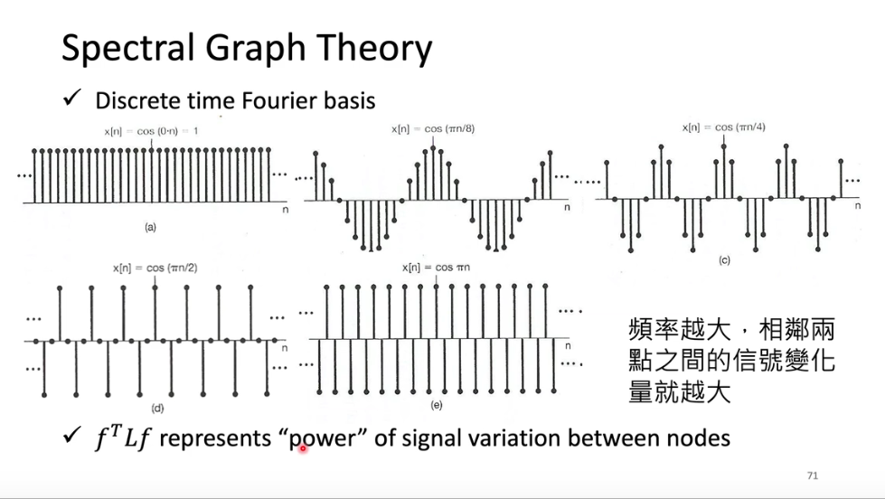

对vertex domain进行变换之后，就可以在频域对结点信息进行分析： 

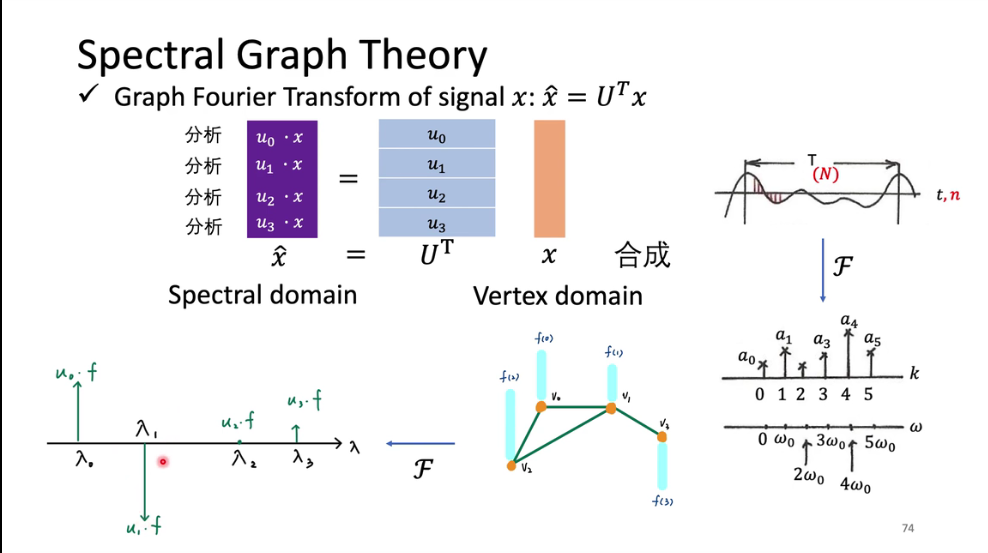

逆变换：右边四个橙色的相加，得到左边的蓝色： 

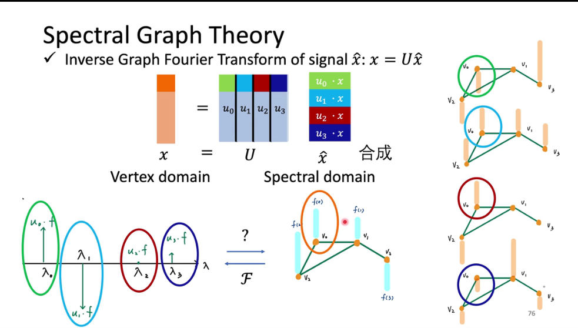

这些变换实际上是为了找出一个可以在图上面做Filter的方法（类比信号与系统中的低通高通filter）

**因此，所谓的图卷积实际上就是找到一种变换将其转化到频域，然后直接用相乘的形式来做（卷积在频域就是乘法！）**

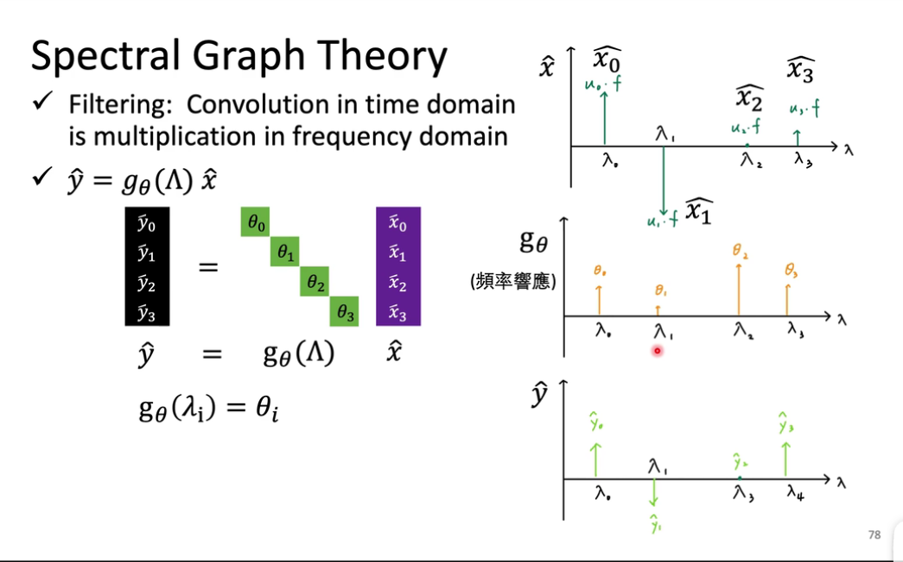

因此，可以表现成如下形式：关键在于学习到一个函数表示$g_{\theta}(·)$ 

也就是$y=g{\theta}(L)x$

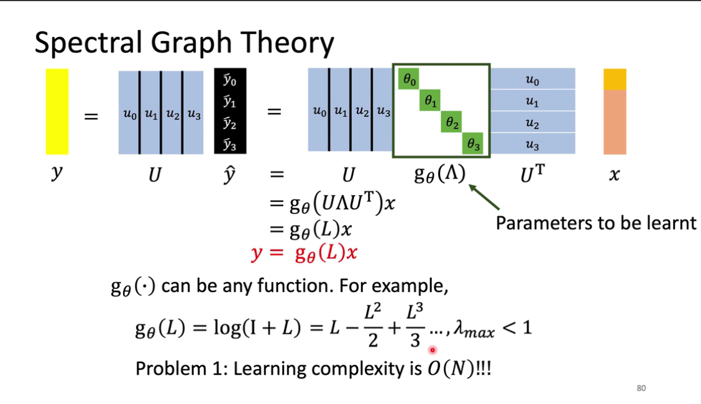

##### GCN

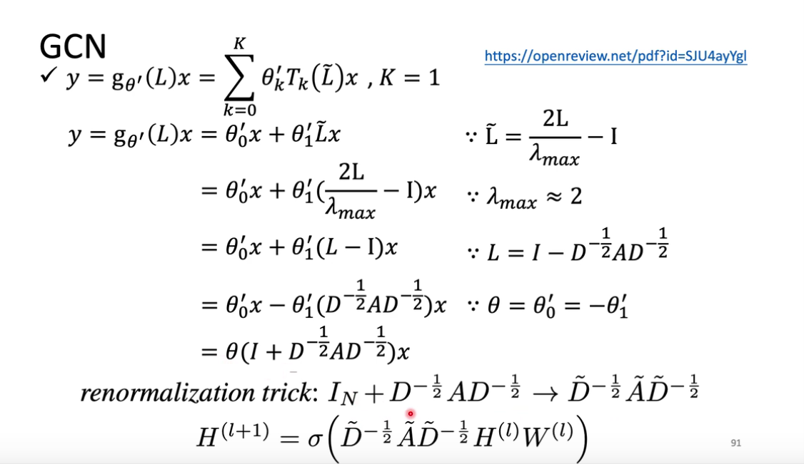

这里的D~就是加上IN之后的D(Dgree Matrix,连接度矩阵)，也就是说如果不是1的话就把他变成1，加了一个self-loop(自环，防止失去自我，后边求和时不仅要加上邻居还要加上自己)，H是上一层的输出，W是权重，A是adjacent matrix，邻接矩阵。

化简之后就是这样：把这个节点的所有邻居（包括他自己，self-loop）全部乘上权重后取平均，再加上一个偏置b，然后过一个激活函数： 
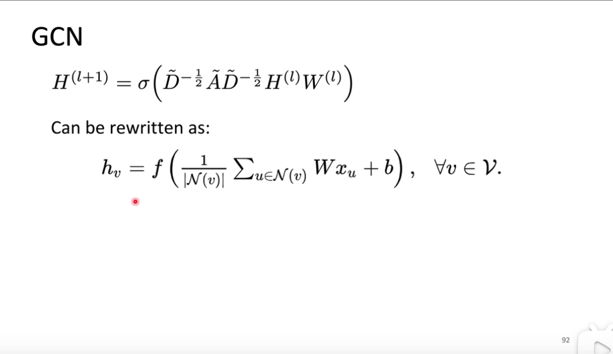

#### 总结
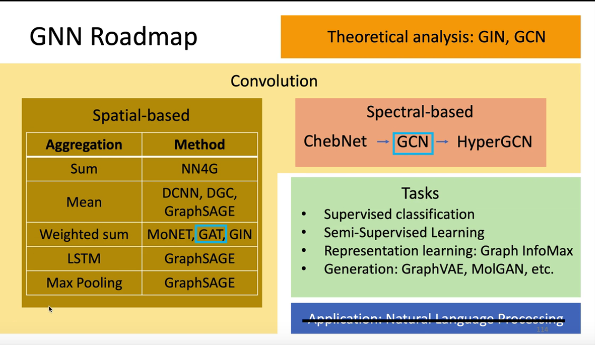

Summary
- GAT and GCN are the most popular GNNs
- Although GCN is mathematically driven, we tend to ignore its math
- GNN (or GCN) suffers from information lose while getting deeper
-
- Many deep learning models can be slightly modified and designed to fit graph data, such as Deep Graph InfoMax, Graph Transformer, GraphBert.
- Theoretical analysis must be dealt with in the future
- GNN can be applied to a variety of tasks

#### Geom-GCN: Geometric Graph Convolutional Networks

#### Generalizing graph neural networks beyond homophily

#### Adaptive universal generalized pagerank graph neural network

