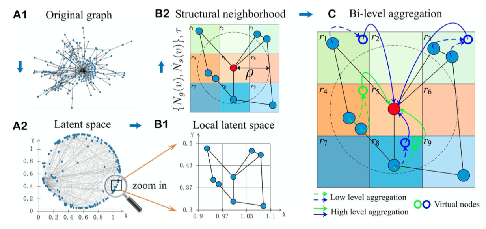

<p align='center'>
<a href="https://github.com/satoshiSchubert" target="_blank"></a>


入门视频链接：
1. https://www.bilibili.com/video/BV1G54y1971S?from=search&seid=16113980904456996368&spm_id_from=333.337.0.0
2. https://www.bilibili.com/video/BV1Tf4y1i7Go/?spm_id_from=333.788.recommend_more_video.-1
3. https://www.bilibili.com/video/BV1Tf4y1i7Go/?spm_id_from=autoNext
4. https://www.bilibili.com/video/BV1ta4y1t7EK?from=search&seid=11867558855037378426&spm_id_from=333.337.0.0
5. https://www.bilibili.com/video/BV1T54y1H7Hs/?spm_id_from=333.788.recommend_more_video.6

#### 如何使用卷积的方法把把节点嵌入到特征空间中呢？
- Solution1: Generalize the concept of convolution(corelation) to gragh>>Spatial-based convolution
- Solution2: Back to the definition of convolution in signal processing>>Spectral-based convolution

**Tasks**
- Semi-supervised node classification
- Regression
- Graph classification
- Graph representation learning
- Link prediction
**Common dataset**
- CORA: citation network. 2.7k nodes and 5.4k links
- TU-MUTAG: 188 molecules with 18 nodes on average

#### Spatial-based convolution

##### **NN4G(Neural Network For Graph)**<br>
每一层是怎么更新的：<br>
这一步实际上叫做**聚合(aggregation)**
<br>

Readout：<br>
<br>

##### **DCNN(Diffusion-Convolution Neural NEtwork)**
在这个图中，蓝色层和红色层和之后的层的节点数据来源都是初始的黄色层，这里d(3,·) = 1的意思是和3号节点距离为1的所有点，也就是说上标越大，他聚合的就是越远的信息：<br>
<br>

这样处理K次就可以得到K层的H矩阵，里面包含了每一次的h<sub>i</sub>的信息：<br>
<br>

然后乘以权重，得到节点的feature：<br>
<br>

##### GAT(Graph Attention Network)
https://www.bilibili.com/video/BV1T54y1H7Hs/?spm_id_from=333.788.recommend_more_video.6


对邻居节点的权重进行学习，做Attention。<br>
这里用了一个函数f来计算相邻节点之间的权重，或者能量e；
<br>

#### Spectral-based convolution


频率越大，相邻两点之间的信号变化就越大

下面的公式实际上是离散微分（拉普拉斯）

$Lf = (D-A)f = Df-Af$


可以看出，Laplacian实际上就是sum of difference between v0 and its neighbors(能量差)<br>
但是，能量是要通过平方来表示的，也就是$f^TLf$


对vertex domain进行变换之后，就可以在频域对结点信息进行分析：<br>


逆变换：右边四个橙色的相加，得到左边的蓝色：<br>


这些变换实际上是为了找出一个可以在图上面做Filter的方法（类比信号与系统中的低通高通filter）

**因此，所谓的图卷积实际上就是找到一种变换将其转化到频域，然后直接用相乘的形式来做（卷积在频域就是乘法！）**


因此，可以表现成如下形式：关键在于学习到一个函数表示$g_{\theta}(·)$<br>

也就是$y=g{\theta}(L)x$


##### GCN


这里的D~就是加上I<sub>N</sub>之后的D(Dgree Matrix,连接度矩阵)，也就是说如果不是1的话就把他变成1，加了一个self-loop(自环，防止失去自我，后边求和时不仅要加上邻居还要加上自己)，H是上一层的输出，W是权重，A是adjacent matrix，邻接矩阵。

化简之后就是这样：把这个节点的所有邻居（包括他自己，self-loop）全部乘上权重后取平均，再加上一个偏置b，然后过一个激活函数：<br>


#### 总结


Summary
- GAT and GCN are the most popular GNNs
- Although GCN is mathematically driven, we tend to ignore its math
- GNN (or GCN) suffers from information lose while getting deeper
- Many deep learning models can be slightly modified and designed to fit graph data, such as Deep Graph InfoMax, Graph Transformer, GraphBert.
- Theoretical analysis must be dealt with in the future
- GNN can be applied to a variety of tasks

#### Geom-GCN: Geometric Graph Convolutional Networks

论文主要解决的问题是在传统的图网络模型中，从邻居节点收集信息message，然后利用神经网络节点来更新节点表示，会丢失结构信息，主要是拓扑结构的信息。

在论文**GIN How Powerful are Graph Neural Networks**中也有提到，对于一些拓扑结构，Mean或者Max聚合对于两个不同的节点会丧失辨认能力。

论文主要是通过将节点映射到连续空间的一个向量图嵌入，然后在隐空间中查找邻居并聚合（估计这个映射是可以保留拓扑信息？）


这个流程图说的比较清楚，先用图嵌入把图映射到latent space，然后就可以定量计算节点的邻居的相对位置，这样就可以提取出拓扑信息



圆形虚线内的节点代表了红色节点在隐空间的邻居，圆形虚线外的节点则代表在原始图上的真实邻居

#### Generalizing graph neural networks beyond homophily

目前的GNN大都具有很强的同质性假设，比如相似的会被聚类，但是实际生活中也会存在异质性的情况，比如两个性质截然不同但是连接很紧密的情况（比如男性-女性、他们是一对情侣），同质性的GNN就很难处理这种异质性的情况。

这篇论文分析了GNN在异质网络上的局限性，并确定了一组可以在不牺牲同质性准确性的前提下，提升异质性图结构学习性能的设计。
  
高异质性的图在频域有更高的频率（当然啊），因此如果要考虑异质性的话高频信号也是有用的

证明了GCN处理异质图的缺陷


#### Adaptive universal generalized pagerank graph neural network


### 代码测试

今天花了好久时间配环境（主要还是torch_scatter这些库的版本依赖关系太麻烦），而且有的直接从源码编译一直报错，最后还是通过直接安装whl文件成功渡劫，没在上面卡住。

代码稍微修改一下就能跑，但是不知是不是学长的python版本不同的原因，准确率一直是0，最后发现是evaluate函数的除法有问题。在python3中是默认整除，因此小于0的小数就直接变成0了，在分母乘上1.0即可。


学长原版代码：
```python
    def forward(self, data):
        x = data.x
        x = F.dropout(x, p=0.6, training=self.training)
        x = F.relu(self.conv1(x,data.edge_index))
        x = F.dropout(x, p=0.6, training=self.training)
        x = self.conv2(x,data.edge_index)
        #x = F.relu(self.conv(x,data.edge_index))
        #x = self.conv(x,data.edge_index)
        return F.log_softmax(x,dim=1)
```
result(avg_acc = 0.56):
```cpp
runfile('L:/A_Simple_Project/sample.py', wdir='L:/A_Simple_Project')
0.54780704
runfile('L:/A_Simple_Project/sample.py', wdir='L:/A_Simple_Project')
0.55899125
runfile('L:/A_Simple_Project/sample.py', wdir='L:/A_Simple_Project')
0.552193
runfile('L:/A_Simple_Project/sample.py', wdir='L:/A_Simple_Project')
0.56513155
runfile('L:/A_Simple_Project/sample.py', wdir='L:/A_Simple_Project')
0.5585526
runfile('L:/A_Simple_Project/sample.py', wdir='L:/A_Simple_Project')
0.5736842
runfile('L:/A_Simple_Project/sample.py', wdir='L:/A_Simple_Project')
0.5482456
runfile('L:/A_Simple_Project/sample.py', wdir='L:/A_Simple_Project')
0.5578947
runfile('L:/A_Simple_Project/sample.py', wdir='L:/A_Simple_Project')
0.5539473
runfile('L:/A_Simple_Project/sample.py', wdir='L:/A_Simple_Project')
0.5447368
```

稍微改了一下（改了一点点），性能有一丁点提升：
```python
    def forward(self, data):
        
        x, edge_index = data.x, data.edge_index
        x = self.conv1(x,data.edge_index)
        x = F.relu(x)
        x = F.dropout(x, training=self.training)
        x = self.conv2(x, edge_index)
        
        return F.log_softmax(x,dim=1)
```

result(avg_acc = 0.5776)：
```python
runfile('L:/A_Simple_Project/sample.py', wdir='L:/A_Simple_Project')
0.5620614
runfile('L:/A_Simple_Project/sample.py', wdir='L:/A_Simple_Project')
0.5923246
runfile('L:/A_Simple_Project/sample.py', wdir='L:/A_Simple_Project')
0.57061404
runfile('L:/A_Simple_Project/sample.py', wdir='L:/A_Simple_Project')
0.5877193
runfile('L:/A_Simple_Project/sample.py', wdir='L:/A_Simple_Project')
0.5725878
runfile('L:/A_Simple_Project/sample.py', wdir='L:/A_Simple_Project')
0.585307
runfile('L:/A_Simple_Project/sample.py', wdir='L:/A_Simple_Project')
0.56885964
runfile('L:/A_Simple_Project/sample.py', wdir='L:/A_Simple_Project')
0.5796052
runfile('L:/A_Simple_Project/sample.py', wdir='L:/A_Simple_Project')
0.5828947
```


