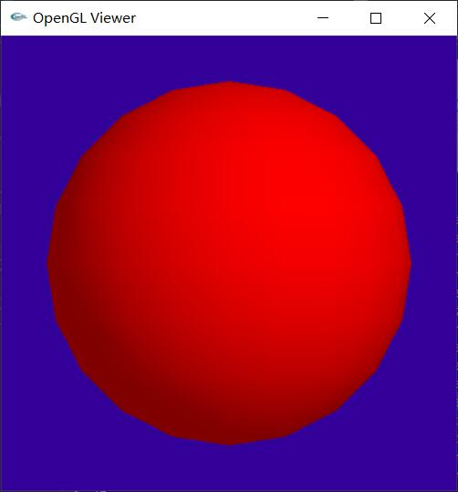
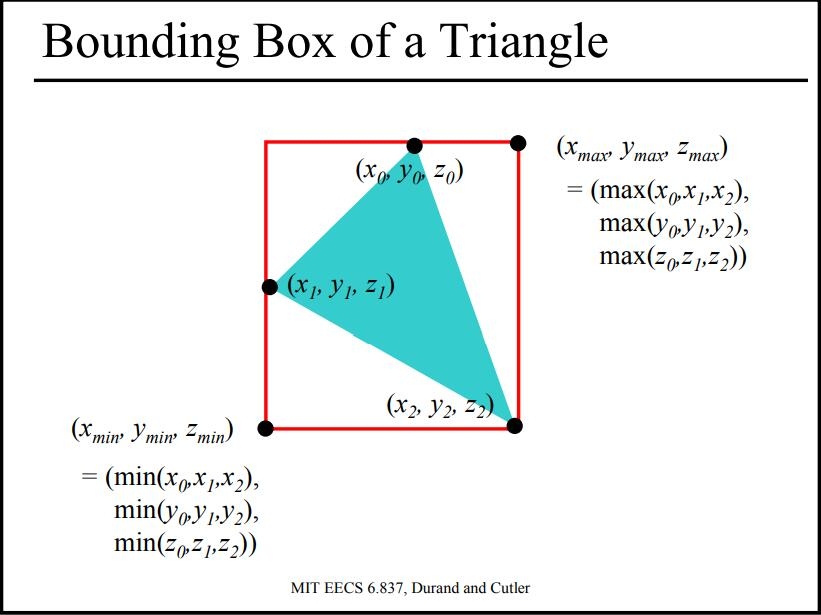
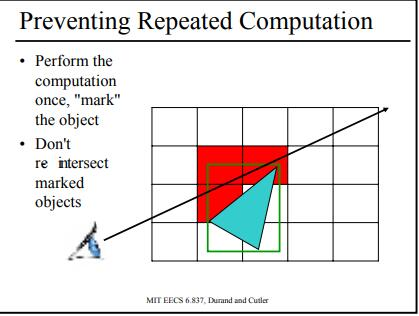

<p align='center'>
<a href="https://github.com/satoshiSchubert" target="_blank"></a>


# MIT-CG-6.837--2004
---
**6.837 Intro to Computer Graphics, Fall 2004**

http://groups.csail.mit.edu/graphics/classes/6.837/F04/index.html 

环境配置：

- Win10 + VS2017
- source: 源代码文件
- release: 可执行文件，input file和批处理命令

## 目录

---
## A0. Iterated Function Systems
---
(补档)

### 记录点
1. 概述
  
    6.837的第一个作业，实现IFS算法。目的是熟悉C++的语法特性，并且熟悉使用两个和图像生成和线性代数相关的简单库。通过生成一些奇妙的分形物体来体会图形学的乐趣。

    IFS **是一种构造分形的方法，得到的分形通常是自相似(self-similar)的**。IFS最经典的例子是绘制一种蕨类植物(Barnsley’s fern)，如下图所示，可以看到，每一个子叶片与整个叶片的形状相同。

    IFS由**一个仿射变换(affine transformations)集合所定义，通常定义的仿射变换包括旋转(rotation)、缩放(scale)、平移(translations)、斜切(skew)等等线性变换方法**。这些变换不着了自相似的物体形状。IFS可以定义在多个维度上，在这个作业中，我们只需实现二维的变换。


## A1. Ray Casting
---
(补档)
### 记录点
1. 概述
   
    本实验的目标是要完成一个光线投射算法。光线投射算法的原理如下图（文字部分为个人见解）：

    对于每一个像素
    - 构建一条从视点处开始的射线
      - 对场景中的每一个对象
      - 判断当前射线是否和当前对象有交点（此处要用到求交点函数） 
      - 如果有且该交点距离视点更近，则更新最近交点值


## A2. Transformations
---
(补档)
### 记录点
1. 概述
   
    本实验的目标是实现更多的基本图元（如Plane、Triangle类的实现）、新增两种渲染模式(normal visualization和diffuse shading)、新增PerspectiveCamera类及变换(Transform类)的实现。


## A3. Phong_Shading
---
### 记录点

1. **光照模型**
   
    需要实现Blinn_Torrance版本的phong模型。

    

    公式：

    $\mathbf{h}=\frac{\mathbf{I}+\mathbf{v}}{\|\mathbf{I}+\mathbf{v}\|}$ （这一步实际上就是标准化Normalize，因此可以直接调用函数，不必用Devide）

    $L_{o}=(k_{d}(\mathbf{n} \cdot \mathbf{l})+k_{s}(\mathbf{n} \cdot \mathbf{h})^{q}) \frac{L_{i}}{r^{2}}$

    由于assignment3中使用的不是点光源，因此可以忽略r<sup>2</sup>项。
   
2. **Phong和Bling-Phong的区别**
   1. Phong和Blinn-Phong是计算镜面反射光（也叫高光反射）的两种光照模型，两者仅仅有很小的不同之处。
   2. Phong模型中计算反射光线的向量是一件相对比较耗时的任务，因此Blinn-Phong对这一点进行了改进。
   3. Phong适合模拟塑料，比"反射"材质表现出的介质更光滑一些，适合模拟玻璃、水、冰等高反光特性的介质
   4. BlinnPhong大多适用于金属材质。

3. **Flat着色和Gouraud着色**
    1. Flat着色：对于每个mesh小平面，其法向量就是该平面的向量（因此很方便计算）:
    ```cpp
      Vec3f::Cross3(n, position[index[0]] - position[index[1]], position[index[2]] - position[index[1]]);
      glNormal3f(n.x(), n.y(), n.z());
    ```
    效果就比较拉了：

    

    2. Gouraud着色：法线是每一步长计算出来的球法向量：
    ```cpp
      Vec3f pos = Vec3f(sin(phi)*cos(theta),cos(phi), sin(phi)*sin(theta));
			//pos.show();
			position.push_back(_center + pos * _radius);
			normal.push_back(pos); 
      ......
      glNormal3f(normal[index[i]].x(), normal[index[i]].y(), normal[index[i]].z());
    ```

    效果更好，但是计算量也更大（估计主要在三角函数的计算上）

    


4. **OpenGL安装**

    安装openGL时就碰到问题了，估计是dll文件一直没法链接上去，卡了半天。。

    [OpenGL+VS2017 环境配置(亲测好使)::附带必要知识点](https://blog.csdn.net/AvatarForTest/article/details/79199807?spm=1001.2101.3001.6650.2&utm_medium=distribute.pc_relevant.none-task-blog-2%7Edefault%7ECTRLIST%7Edefault-2.no_search_link&depth_1-utm_source=distribute.pc_relevant.none-task-blog-2%7Edefault%7ECTRLIST%7Edefault-2.no_search_link)

    - OpenGL只提供声明不提供实现，实现由各大硬件厂商完成
    - 库文件(lib)和头文件/包含文件(include)是相辅相成的

    .lib, .dll这些文件的区别：
    [关于lib文件的介绍](https://blog.csdn.net/m0_37876745/article/details/78323848?utm_medium=distribute.pc_relevant.none-task-blog-2~default~baidujs_baidulandingword~default-0.no_search_link&spm=1001.2101.3001.4242.1)

    >dll其实就是exe，只不过它没有main函数，所以不能单独执行而已。

    最后还是参考了fuzhanzhan大神的代码，直接用了他的GL文件，只要在项目中设置好include和lib的路径就好了（记得lib还得加上glut32.lib，电脑里没有就去网上下一个）


5. **球坐标换算**

    

6. **使用extern时碰到的问题**

    在处理对球体进行网格化的参数的时候，本来想让其全局化，但是使用extern的时候一直在报“无法解析的外部符号”的错误。要不然只能通过传参的方式一步一步传到sphere的paint()函数中。。

    但这样就会造成raytracer的参数表太长太长，而且这个参数只有sphere类会用到，显得很冗余，不干净利落。

    最后发现问题不是在于extern，而是在我对这些参数进行具体定义的地方（main.cpp）:我把参数定义写在了main()函数里，可能正因如此它无法作为“全局”参数而extern被识别到？

    后来把参数定义部分挪出main函数后，就可以正常编译项目了。

7. **使用vector时碰到的问题**

    在Plane:print()函数中，我用vector<Vec3f>来存四个点，但是不知为何无法正确存入数据；而用类数组Vec3f Rect[4]={A,B,C,D}则可以正常运行。

8. **生成TGA图像时碰到的问题**

    第九张图片不知为何无法生成tga图像，但是openGL是正常的。

## A4. Shadows, Reflection & Refraction
---

### 记录点

1. Ray Casting 和 Rendering Pipeline的区别
   
   我的理解是，这是两种计算模式？

   - Ray Casting：
     ```python
     for each pixel:
         for each object:
     ```
   - Rendering Pipeline:
     ```python
     for each triangle:
         for each pixel:
     ```

    

    

2. Shadows
   
   先考虑引入了Phong Shading的Ray Casting：
   
   ```python
   #当你已经找到了最近的hit point时
   color = ambient*hit->getMaterial()->getDiffuseColor()
   for every light
        #对于每个光源，都分别计算并累加Shade颜色
        color += hit->getMaterial()->Shade(ray,hit,direction,lightColor)
    return color
   ```
   复杂度：$O(n*m*l)$,其中l=num of lights

   那么如何添加阴影呢？

    ```python
   #当你已经找到了最近的hit point时
   color = ambient*hit->getMaterial()->getDiffuseColor()
   # 对于每个光源
   for every light
        // ========CHANGE========
        #初始化一个从Hit点到光源的射线
        Ray ray2(hitPoint,directionToLight)
        #初始化一个t等于hitpoint到光源的距离的Hit
        Hit hit2(distanceToLight, NULL, NULL)
        #对于在场的所有物体（实际上只关注ray2光路上的物体）
        for every object:
            #迭代intersect
            object->intersect(ray2,hit2,0)
        #如果迭代之后t仍然还等于distanceToLight
        #也就是ray2光路上没有其他的阻碍物
        #这时候才更新Shade，否则就只留有ambient
        #（因为从光源到这个hitpoint之间有东西挡着）
        if(hit2->getT()=distanceToLight):
        // ========CHANGE========
            color += hit->getMaterial()->Shade(ray,hit,direction,lightColor)
    return color
   ```
   
   配图：注意橙色箭头和太阳之间有个物体阻挡。

   

   问题：自阴影（self-shadowing）--需要在计算intersect的时候添加一个epsilon（估计是增加容错率？）

   **这个epsilon现在还没搞懂是啥**

   

   **Shadow Optimization**如何提高shadow的计算效率呢？在检测ray2光路的交点时，只需要知道是否有其他交点，而不需要知道哪个交点最近

   这就需要写一个新的routine：``Object3D::intersectShadowRay()``
   and it stops at first intersection.

3. Reflection
   
   最基本的：入射角等于反射角。
   $$
   R=V-2(V·N)N
   $$

   

   在这次assignment中，用的是传统的ray tracing，反射量是个常量，但是如果考虑更加真实的情况的话，应该要考虑fresnel reflection term

   material->reflect函数的具体实现:

   ```cpp
   bool PhongMaterial::reflect(const Ray &ray, const Hit &hit, Vec3f &attenuation, Ray &reflected) {
        // 这个函数用来计算反射光线并传递给参数ray
        // reflectiveColor是材料的“反射率”，如果太小则认为这个点无法产生反射，返回false
        // 这个材料的“反射率”作为参数传给attenuation，以用来衰减光线的weight
        if (_reflectiveColor.Length() < 0.001)
            return false;
        // 计算反射光线
        // R=V-2(V·N)N | R:Reflected, V:View, N:Normal
        Vec3f ray_in = ray.getDirection();
        Vec3f normal = hit.getNormal();
        Vec3f ray_out = ray_in - 2.f*normal.Dot3(ray_in)*normal;
        ray_out.Normalize();
        reflected = Ray(hit.getIntersectionPoint(), ray_out);
        attenuation = _reflectiveColor;
        return true;
    }
   ```

4. Refration
   
   经过（复杂的）推导，得到折射公式如下：

   $$
   \left[\eta_{r}(\mathbf{N} \cdot \mathbf{I})-\sqrt{1-\eta_{r}{ }^{2}\left(1-(\mathbf{N} \cdot \mathbf{I})^{2}\right)}\right] \mathbf{N}-\eta_{r} \mathbf{I}
   $$

   

   具体实现：

   ```cpp
   bool PhongMaterial::refract(const Ray &ray, const Hit &hit, Vec3f &attenuation, Ray &refracted) {
        if (_transparentColor.Length() < 0.001)
            return false;
        Vec3f ray_in = ray.getDirection();
        Vec3f normal = hit.getNormal();
        // Snell-Descartes Law:nr = (sinT)/(sinI) = ni/nt
        float nr;
        if (ray_in.Dot3(normal) > 0) {
            normal = -1 * normal;
            nr = _indexOfRefraction;
        }
        else {
            // 正常情况
            nr = 1.f / _indexOfRefraction;// 空气是1
        }
        Vec3f I = ray_in * -1; // 参考示意图！
        float N_I = normal.Dot3(I);
        float t = 1 - pow(nr, 2)*(1 - pow(N_I, 2));
        // t should be greater than 0
        if (t > 0) {
            Vec3f T = (N_I * nr - sqrtf(t)) * normal - nr * I;
            T.Normalize();
            refracted = Ray(hit.getIntersectionPoint(), T);
            // 向外传递参数
            attenuation = _transparentColor;
            return true;
        }
        else {
            return false;
        }
    }
    ```

5. RayTracer 框架
   
   

   不断递归后的效果：

   

   Ray Tree:

   

   代码的具体实现(参考fuzhanzhan大佬)：

   ```cpp
   Vec3f RayTracer::traceRay(Ray &ray, float tmin, int bounces, float weight, Hit &hit) {

        Group *group = scene->getGroup();

        // Shader
        if (group->intersect(ray, hit, tmin)) {
            // Original ray without any bounces.
            if (bounces == 0) {
                // 画出从tmin（也就是视点附近）到交点的直线
                RayTree::SetMainSegment(ray, tmin, hit.getT());
            }
            // Initialize.
            Vec3f pixelColor(0.f, 0.f, 0.f);
            Vec3f hitPoint = hit.getIntersectionPoint();
            Material *material = hit.getMaterial();
            // 环境光*物体材料颜色
            pixelColor += scene->getAmbientLight() * material->getDiffuseColor();
            // For each light souce:
            for (int k = 1; k < scene->getNumLights(); k++) {
                Light *light = scene->getLight(k);
                Vec3f lightDir, lightColor;
                float distance;
                light->getIllumination(hitPoint, lightDir, lightColor, distance);
                // <----------Shadows---------->
                Ray ray_shadows(hitPoint, lightDir);
                Hit hit_shadows(distance);
                if (shadows) {
                    if (!group->intersectShadowRay(ray_shadows, hit_shadows, tmin))
                        pixelColor += material->Shade(ray, hit, lightDir, lightColor);
                }
                else
                    // Routine without shadow  
                    pixelColor += material->Shade(ray, hit, lightDir, lightColor);
                RayTree::AddShadowSegment(ray_shadows, tmin, hit_shadows.getT());
            }
            // <----------Reflective---------->
            Ray lightScattered;
            Vec3f attenuation;// 衰减率（实际上是击打点材料的反射率，越镜面越高）
            // 但是这个反射率应该是小于1的，因此每次反射光线weight都会有衰减

            // 如果反弹次数小于最大反弹次数且光线weight大于阈值weight
            // reflect函数中计算反射光线
            if (bounces<max_bounces && weight>cutoff_weight && material->reflect(ray, hit, attenuation, lightScattered)) {
                // 无穷远的参考Hit
                Hit hit_ref(INFINITY);
                // 递归
                pixelColor += attenuation * traceRay(lightScattered, tmin, bounces + 1, weight*attenuation.Length(), hit_ref);
                RayTree::AddReflectedSegment(lightScattered, tmin, hit_ref.getT());
            }
            // <----------Reflactive---------->
            if (bounces < max_bounces && weight>cutoff_weight && material->refract(ray, hit, attenuation, lightScattered)) {
                Hit hit_ref(INFINITY);
                // 递归
                pixelColor += attenuation * traceRay(lightScattered, tmin, bounces + 1, weight*attenuation.Length(), hit_ref);
                RayTree::AddTransmittedSegment(lightScattered, tmin, hit_ref.getT());
            }
            return pixelColor;
        }
        else {
            return scene->getBackgroundColor();
        }
    }
   ```


6. Plane的intersect()部分DEBUG

    画第一个图的时候，我画出来的阴影总是不对，如下所示

    正常：

    

    而我画出来的:

    

    乍一看，（抛开球体没有上色不谈）阴影的投影好像没有什么大问题，但是和示例比起来可以发现球体的底部和平面有切割，且阴影也偏扁平，直观上看起来**似乎平面和球的距离变小了**。

    但是经过长时间的排查，排除了camera，light等等的原因，最后把问题定位在plane的intersect()函数上。经过对比公式，发现计算t的式子出现了一点错误(但是之前两次作业竟然一直都没发现！)，直到这次计算投影时才发现：

    原代码：

    ```cpp 
    float t = (_d - _v_norm.Dot3(Rd)) / denom;
    ```

    实际上正确的代码：

    ```cpp 
    float t = (_d - _v_norm.Dot3(Ro)) / denom;
    ```

    对应的计算公式：

    


7. Sphere的intersection()部分DEBUG

画阴影的时候，球体的颜色无法正常显示，也被当成阴影处理了，因此显示出来的颜色和底色一样（如上图）。刚开始考虑是没有添加epsilon，以致球面和自己相交，被误判定为阴影，后来通过不断debug，发现问题出在基础的object3d模块上，Sphere类的intersect()函数有问题：

第一个问题在于intersect()中更新hit的操作。之前更新hit是直接令`h = Hit(t, _material, v_norm);`，并且也没有出现什么问题，前两次作业的结果都是OK的（因此这次作业也很难想到是这些基础模块出问题）。实际上，这里必须要用`h.set(t, _material, v_norm, r)`，不能新创建一个Hit并赋值，因为set函数中会根据ray内部设置intersectionPoint = ray.pointAtParameter(t)，而这个intersectionPoint又会在raytracer.cpp `Vec3f hitPoint = hit.getIntersectionPoint()` 中被调用，因此，如果没有设置，则无法正常调用并生成hitPoint，后面的ray_shadows也就会是错误的。虽然问题出在sphere的intersect()函数中，但是因为画shadow时在一个像素routine中会循环调用多次intersect()，所以很难打印t来发现问题。

第二个问题则是出在intersect()本身的if else结构上。<br>
之前的结构如下：

```cpp
bool Sphere::intersect(const Ray &r, Hit &h, float tmin) {
	...
	if (delta < 0)
		// No hit.
		return false;
	float t = INFINITY ; //t的初始值应该是无限远！
	...
	if (t < h.getT() && t >= 0) {//closer当前交点，更新
		Vec3f v_norm = Vec3f(r.pointAtParameter(t), _center);
		v_norm.Normalize();
		h = Hit(t, _material, v_norm);
	}
	return true;
```
这种结构下，只要是delta>0的，不论是否`t < h.getT()`，最后都会return true，但是实际上会出现delta>0(有成功相交)但是并没有更新交点hit的情况，这种情况也应该是return false的。

修改后：

```cpp
bool Sphere::intersect(const Ray &r, Hit &h, float tmin) {
	...
	if (delta >= 0) {
		...
		if (t < h.getT()) {//closer当前交点，更新
			Vec3f v_norm = Ro + t * Rd;
			v_norm.Normalize();
			h.set(t, _material, v_norm, r);
			return true;
		}
	}
	return false;
```
这样，delta>0但是却没有更新交点的情况也会被判为false。


## A5. Voxel Rendering

----
### 记录点

0. 补充：类成员函数中const的使用
   
   参考：https://www.jianshu.com/p/35c8a245d62d

   一般放在函数体后，形如：`void fun() const;`

    如果一个成员函数的不会修改数据成员，那么最好将其声明为const，因为const成员函数中不允许对数据成员进行修改，如果修改，编译器将报错，这将大大提高程序的健壮性。
   

1. Ray Casting 和 Rendering Pipeline的区别
   
   我的理解是，这是两种计算模式？

   - Ray Casting：
     ```python
     for each pixel:
         for each object:
     ```
   - Rendering Pipeline:
     ```python
     for each triangle:
         for each pixel:
     ```

    

    

2.  Bounding Box

   如何对RT算法进行加速?

   cost ≈ height * width * num primitives * intersection cost * size of recursive ray tree * num shadow rays *num supersamples *num glossy rays * num temporal samples *num focal samples * ...

   那么其实，可以从减少num primitives做起。

   这就可以使用Bounding Box了。每个primitives都有一个最小的BBOX，通过计算筛去绝对不会和视野相交的BBOX及其所包含的Primitives，就可以实现减少计算量。

   复习一下如何判断一个Box和视线相交：

   

   那么如何计算每一种primitive的bbox呢?实际上很简单，只需要注意求最大最小值就行：

   球的BBOX：

   

   平面的BBOX（通常来说是无穷大）：

   

   对应transform的BBOX：

   

   三角形则比较特殊，他的BBOX如下：

   

   而对于变换后的三角形，BBOX如下：

   

3. 父类中若需要用到子类，则需要在前面提前声明
   
   在object3d.h中，父类Object3D中用到了他的一个派生子类Grid,如果不在其之前声明则会报错。

   ```cpp
   //这里需要提前声明一下Grid
    class Grid;
    // Object3D
    class Object3D {
        ...
    }
    ```

4. Grid加速的总体框架
    
    
    1. 首先先创建一个Grid，并且确定分辨率（nx，ny），注意每个格子的单位长宽不能相等（为什么？）

    

    2. 将Objects插入Grid

    

    3. 对于某一条射线经过的所有cell，进行判断

    当前经过的cell是否有objects插入？如有，则返回最近的插入，如没有，则继续

    

    4. 避免重复计算（这步不是很清楚，如果有效交点在后面的cell怎么办？）

    光线碰到一个object时，先mark一下；之后如果再碰到这个mark过的object，就不重复计算交点了。
    
    

    5. 忽略超出Grid范围的intersect(这步也不是很清楚，为什么maybe sth closer？)

    

    6. 那么对于某条光线，如何得到它路径上所经过的cell呢？这就需要用到3DDDA了

5. 3D DDA(Three Dimensional Digital Difference Analyzer)

    参考：https://zhuanlan.zhihu.com/p/415869768

    在求光线和voxel的交点时，更方便的方法是初始阶段先手动计算光线和第一个voxel焦点，之后再使用3D DDA方法不断扩展。

    3D DDA方法：<br>

    1. 注意到x轴和y轴中的间隔是均匀的

    这里的dirx等同于角度的cos，diry是角度的sine

    

    2. 不断步进

    我们维护一个距离，而每个交点由于在坐标轴上，而网格是均匀分割的，因而同样平行线上 的所有交点（如上图中所有绿点）与起点距离可以轻松的累加得到。我们可以发现这个类似于DDA的算法，由于我们每次可能的交点都会出现在三个轴平面上，我们分别寻找接下来分别在三个轴平面上的三个交点，获取最近的那个做步进，显然我们根据交点所在的轴得知下一个cell的方位，比如我们交于xy平面，那肯定就是z轴步进1了。并且这样的做法一定是保守的。
    
    
    


## A6. Grid Acceleration & Solid Textures

1. 纹理生成
    
    这次的作业中都是程序性纹理，也就是没有使用贴图的，因此如何设计这个纹理的程序就很关键。

    对于最基本的棋盘格，关键在于如何周期性实现棋盘格，一提到周期性可以联想到三角函数，那么我们可以通过一个很简单的方式来实现棋盘格相邻交错。
    
    对于XYZ三轴，将其对应的每轴的值的sine相乘，得到一个bool函数，这个函数的正负代表棋盘格的两色。

    ```cpp
    float flg_sin = sin((1.f/T) * p.x()) * sin((1.f / T) * p.y()) * sin((1.f / T) * p.z());
	if (flg_sin > 0)
		return _material1->Shade(ray, hit, l, lightColor);
	else
		return _material2->Shade(ray, hit, l, lightColor);
    ```

2. 噪声生成

    使用Perlin噪声：

    ```cpp
    Vec3f p = hit.getIntersectionPoint();
	_mat_wd2tex->Transform(p);

	float N = 0.f;
	for (int i = 0; i < octaves; i++) {
		int I = pow(2, i);
		N += PerlinNoise::noise(I*p.x(), I*p.y(), I*p.z()) / (1.f*I);
	}
	//Rescale
	if (N > 1) N = 1;
	if (N < 0) N = 0;
    //然后用这里的N做差值，也就是N*A+(1-N)*B
    ```


## A7. Supersampling and Antialiasing

**记录点1：**


## A8. Curves & Surfaces

**记录点1：**


## A9. Particle Systems

**记录点1：**


## END
