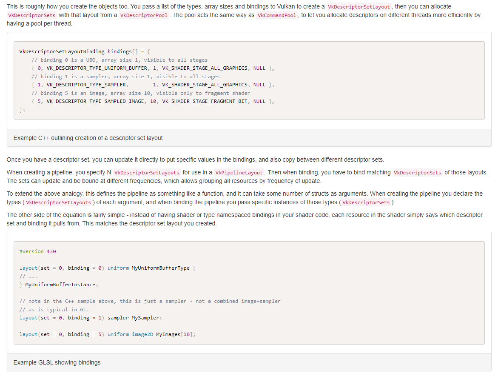

# VulkanRT学习笔记

Author: Satoshi Schubert

Email: crisprhhx@outlook.com

reference：

1. <https://zhuanlan.zhihu.com/p/20712354>

2. <https://renderdoc.org/vulkan-in-30-minutes.html>

## Vulkan部分

-----

### INTRO:Vulkan的几个基本模块

1. Device：
   1. 也就是GPU
2. Pipeline：
   1. 包括大部分状态和设定，在初始化的时候就完成验证和编译。
   2. 因此如果有不同的Pass，就需要提前写好不同的Pipeline。
   3. 然而我们不能把所有渲染需要的信息全都prebake进pipeline中，一个Pipeline应该是可以通过绑定不同的资源而复用的。
3. Buffer：
   1. 不同种类的内存分配,指定cpu、gpu谁可见
   2. Vertex Buffer, Index Buffer, Uniform Buffer等等
4. Image：
   1. 在Vulkan中代表所有具有像素结构的数组，可以用于表示纹理，Render Target等等（类似一个MAT？）
   2. 和其他组件一样，Image也需要在创建的时候指定使用它的模式，例如Vulkan里有参数指定Image的内存Layout，可以是Linear，也可以是Tiled Linear便于纹理Filter。
   3. 纹理本身并不直接绑定给Pipeline。需要读取和使用Image则要依赖于ImageView。
5. Descriptor Sets
   1. 绑定资源
   2. **Buffer和Image可以动态的绑定给任意Pipeline。而具体绑定的规则就是由Descriptor指定。**
   3. Descriptor Set也需要在被创建的时候，就由App指定它的固定的Layout，**以减少渲染时候的计算量。**因为Descriptor Set是预先创建并且无法更改的，所以改变一个绑定的资源需要重新创建整个Descriptor Set，但改变一个资源的Offset可以非常快速的在绑定Descriptor Set的时候完成。
   4. Descriptor Set Layout可以指定绑定在指定Descriptor Set上的所有资源的种类和数量，以及在Shader中访问它们的索引。
   5. 看图,Descriptor Set需要在被创建的时候，就由App指定它的固定的Layout，**以减少渲染时候的计算量**
   6. 
   7. 也就是说，setLayout描述有什么内容，set内部具体存这些内容
6. CommandBuffer：
   1. 在Vulkan里，没有任何API允许你直接的，立即的像GPU发出任何命令。
   2. 所有的命令，包括渲染的Draw Call，计算的调用，甚至内存的操作例如资源的拷贝，都需要通过App自己创建的Command Buffer。
   3. 相关函数一般都带有vkCmd。
   4. 每一个Command Buffer都需要显式的绑定它所需要的所有渲染状态，Shader，和Descriptor Set等等，没有任何渲染状态会在commandbuffer之间继承。（除非你设定特殊的Flag，让程序制定这些Command只会被调用一次（例如某些资源的初始化），亦或者应该被缓存从而重复调用多次（例如渲染循环中的某个Pass）。）这是为了让驱动能更加简易地优化command的调用。
7. Queue：
   1. 是Vulkan中唯一给GPU递交任务的渠道
   2. Queue的API极其简单，你向它递交任务（Command Buffer），然后如果有需要的话，你可以等待当前Queue中的任务完成。
   3. 基于Command Buffer和Queue递交任务的Vulkan非常易于编写多线程程序。
8. Pool：
   1. Command Pool：Command Buffer Pool是Command Buffer的父亲组件，负责分配Command Buffer。Command Buffer相关的操作会对其对应的Command Buffer Pool里造成一定的工作，例如内存分配和释放等等。因为多个线程会并行的进行Command Buffer相关的操作，这个时候如果所有的Command Buffer都来自同一个Command Buffer Pool的话，这时Command Buffer Pool内的操作一定要在线程间被同步。所以这里建议每个线程都有自己的Command Buffer Pool，这样每个线程才可以任意的做任何Command Buffer相关的操作。

   2. DescriptorSet Pool：所有Descriptor Set都由Descriptor Pool分配，Descriptor Set操作会导致对应的Descriptor Pool工作而且需要线程间同步，并且Descriptor Pool也支持非常高效的将所有由当前Pool分配的Descriptor Set一次性清零。所以程序应该为每个线程分配一个Descriptor Pool，可以根据Descriptor Set的更新频率，创建不同的Descriptor Pool，例如每帧、每场景等等。

### Vulkan编程基本流程

```cpp
/*----------------------------------------------*/
//第一步：先创建一个Vulkan实例。每个实例之间完全孤立
VkInstance inst;
vkCreateInstance(&instanceCreateInfo, NULL, &inst);

//然后，向GPU获取信息，建立和硬件的联系
VkPhysicalDevice phys[4]; uint32_t physCount = 4;
vkEnumeratePhysicalDevice(inst, &physCount, phys);
VkDeviceCreateInfo deviceCreateInfo = {
   "blablabla";
}

//从物理硬件获取完信息之后，绑定到逻辑硬件上：
VkDevice device;
vkCreateDevice(phys[0], &deviceCreateInfo, NULL, &device);
//有了一个逻辑Device之后，就可以开始创建其他东西了
//在Vulkan中，声明一个Buffer或者Image时，要声明一下他的用途
//同时，Image需要通过VkImageView来使用

/*----------------------------------------------*/
/*首先，您从所需的任何本机窗口信息创建一个VkSurfaceKHR。
一旦你有了一个表面，你就可以为那个表面创建一个VkSwapchainKHR。您需要查询诸如该表面上支持哪些格式、链中可以拥有多少个后备缓冲区等信息。
然后，您可以在VkSwapchainKHRvia中获取实际图像vkGetSwapchainImagesKHR()。这些是普通VkImage句柄，但您无法控制它们的创建或内存绑定——这一切都是为您完成的。不过，您将不得不创建一个VkImageView。
当你想渲染到交换链中的一个图像时，你可以调用vkAcquireNextImageKHR()它将返回给你链中下一个图像的索引。您可以对其进行渲染，然后vkQueuePresentKHR()使用相同的索引调用以将其呈现给显示器。*/

// fetch vkCreateWin32SurfaceKHR extension function pointer via vkGetInstanceProcAddr
//与其他图形API一样，Vulkan将窗口系统方面与核心图形API分离开来。
//在Vulkan中，窗口系统的详细信息通过WSI（窗口系统集成）扩展公开。
//下面和Vulkan的显示界面相关，用来显示结果，Win32平台（Vulkan支持很多平台）
VkWin32SurfaceCreateInfoKHR surfaceCreateInfo = {
      // HINSTANCE, HWND, etc
   };
VkSurfaceKHR surface;
vkCreateWin32SurfaceKHR(inst, &surfaceCreateInfo, NULL, &surface);

//创建交换链。它是最终显示给用户的图像缓冲区列表。这是建立呈现所需的所有缓冲区所需的第一个步骤之一
//【参见附录1-交换链】
VkSwapchainCreateInfoKHR swapCreateInfo = {
    // surface goes in here
  };
VkSwapchainKHR swap;
vkCreateSwapchainKHR(device, &swapCreateInfo, NULL, &swap);

/*----------------------------------------------*/
// Again this should be properly enumerated
VkImage images[4]; uint32_t swapCount;
vkGetSwapchainImagesKHR(device, swap, &swapCount, images);

uint32_t currentSwapImage;
//调用vkAcquireNextImageKHR(),它将返回给你链中下一个图像的索引。
vkAcquireNextImageKHR(device, swap, UINT64_MAX, presentCompleteSemaphore, NULL, &currentSwapImage);

// pass appropriate creation info to create view of image
VkImageView backbufferView;
vkCreateImageView(device, &backbufferViewCreateInfo, NULL, &backbufferView)

VkQueue queue;
vkGetDeviceQueue(device, 0, 0, &queue);

/*----------------------------------------------*/
//创建渲染管道
VkRenderPassCreateInfo renderpassCreateInfo = {
   // here you will specify the total list of attachments
   // (which in this case is just one, that's e.g. R8G8B8A8_UNORM)
   // as well as describe a single subpass, using that attachment
   // for color and with no depth-stencil attachment
};

VkRenderPass renderpass;
vkCreateRenderPass(device, &renderpassCreateInfo, NULL, &renderpass);

VkFramebufferCreateInfo framebufferCreateInfo = {
   // include backbufferView here to render to, and renderpass to be
   // compatible with.
};

VkFramebuffer framebuffer;
vkCreateFramebuffer(device, &framebufferCreateInfo, NULL, &framebuffer);

VkDescriptorSetLayoutCreateInfo descSetLayoutCreateInfo = {
   // whatever we want to match our shader. e.g. Binding 0 = UBO for a simple
   // case with just a vertex shader UBO with transform data.
};

//【参见附录2-descriptorSetLayout的Binding和Shader中layout的关系】
VkDescriptorSetLayout descSetLayout;
vkCreateDescriptorSetLayout(device, &descSetLayoutCreateInfo, NULL, &descSetLayout);

VkPipelineCreateInfo pipeLayoutCreateInfo = {
   // one descriptor set, with layout descSetLayout
};

VkPipelineLayout pipeLayout;
vkCreatePipelineLayout(device, &pipeLayoutCreateInfo, NULL, &pipeLayout);

// upload the SPIR-V shaders
//传入Shader模块
VkShaderModule vertModule, fragModule;
vkCreateShaderModule(device, &vertModuleInfoWithSPIRV, NULL, &vertModule);
vkCreateShaderModule(device, &fragModuleInfoWithSPIRV, NULL, &fragModule);

VkGraphicsPipelineCreateInfo pipeCreateInfo = {
   // there are a LOT of sub-structures under here to fully specify
   // the PSO state. It will reference vertModule, fragModule and pipeLayout
   // as well as renderpass for compatibility
};

VkPipeline pipeline;
vkCreateGraphicsPipelines(device, NULL, 1, &pipeCreateInfo, NULL, &pipeline);

VkDescriptorPoolCreateInfo descPoolCreateInfo = {
   // the creation info states how many descriptor sets are in this pool
};

VkDescriptorPool descPool;
vkCreateDescriptorPool(device, &descPoolCreateInfo, NULL, &descPool);

VkDescriptorSetAllocateInfo descAllocInfo = {
   // from pool descPool, with layout descSetLayout
};

VkDescriptorSet descSet;
vkAllocateDescriptorSets(device, &descAllocInfo, &descSet);

VkBufferCreateInfo bufferCreateInfo = {
   // buffer for uniform usage, of appropriate size
};

VkMemoryAllocateInfo memAllocInfo = {
   // skipping querying for memory requirements. Let's assume the buffer
   // can be placed in host visible memory.
};
VkBuffer buffer;
VkDeviceMemory memory;
//Vulkan中，每创建一个Buffer或者Memory都要：1.说明其用途；2.给他分配内存，完了把内存绑定上去
vkCreateBuffer(device, &bufferCreateInfo, NULL, &buffer);
vkAllocateMemory(device, &memAllocInfo, NULL, &memory);
vkBindBufferMemory(device, buffer, memory, 0);

void *data = NULL;
//Memory Mapping技术，是指把Vulkan当中生成的任何内存（VkDeviceMemory）映射到CPU端的一个void*指针的过程，这样我们就可以从CPU端读取或者写入这块内存。
vkMapMemory(device, memory, 0, VK_WHOLE_SIZE, 0, &data);
memcpy(...)//把数据给存到映射出来的指针里，数据从cpu到gpu
vkUnmapMemory(device, memory);

VkWriteDescriptorSet descriptorWrite = {
   // write the details of our UBO buffer into binding 0
};

vkUpdateDescriptorSets(dev, 1, &descriptorWrite, 0, NULL);

// finally we can render something!
// ...
// Almost.

/*----------------------------------------------*/
//下面应该就是一些通用流程了
VkCommandPoolCreateInfo commandPoolCreateInfo = {
   // nothing interesting
};

VkCommandPool commandPool;
vkCreateCommandPool(dev, &commandPoolCreateInfo, NULL, &commandPool);

VkCommandBufferAllocateInfo commandAllocInfo = {
   // allocate from commandPool
};
VkCommandBuffer cmd;
vkAllocateCommandBuffers(dev, &commandAllocInfo, &cmd);

// Now we can render!

vkBeginCommandBuffer(cmd, &cmdBeginInfo);
vkCmdBeginRenderPass(cmd, &renderpassBeginInfo, VK_SUBPASS_CONTENTS_INLINE);
// bind the pipeline
vkCmdBindPipeline(cmd, VK_PIPELINE_BIND_POINT_GRAPHICS, pipeline);
// bind the descriptor set
vkCmdBindDescriptorSets(cmd, VK_PIPELINE_BIND_POINT_GRAPHICS,
                        descSetLayout, 1, &descSet, 0, NULL);
// set the viewport
vkCmdSetViewport(cmd, 1, &viewport);
// draw the triangle
vkCmdDraw(cmd, 3, 1, 0, 0);
vkCmdEndRenderPass(cmd);
vkEndCommandBuffer(cmd);

VkSubmitInfo submitInfo = {
   // this contains a reference to the above cmd to submit
};

vkQueueSubmit(queue, 1, &submitInfo, NULL);

// now we can present
VkPresentInfoKHR presentInfo = {
   // swap and currentSwapImage are used here
};
vkQueuePresentKHR(queue, &presentInfo);

// Wait for everything to be done, and destroy objects
```

【附录】

1. 交换链 SwapChain <br>
   


2. descriptorSetLayout的Binding和Shader中layout的关系<br>
   


## VulkanRT部分

-----
 
### BLAS


