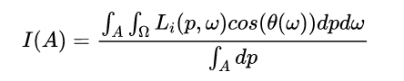
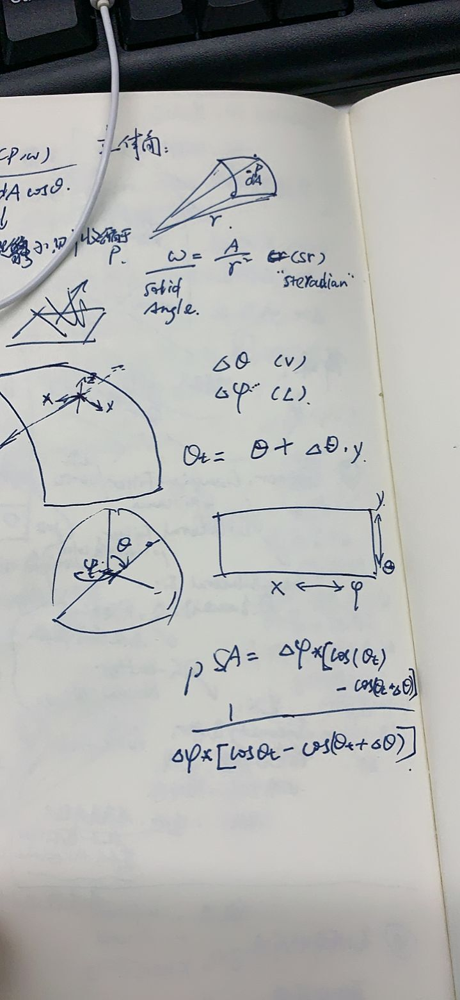

# DOC FOR RAYTOOLS

## sensor

接收器文档

### sensor/Sensor


### sensor/IrradianceSensor

### sensor/IntensitySensor

### sensor/IrradianceAndIntensitySensor

### sensor/FarFieldSensor

远场接收器实现

V:对应Latitude，纬度，对应球面坐标系中的theta

L:Longitude，经度，对应球面坐标系中的phi

计算原理：



理解：这一个小区域能够接受到的光线来自包裹其的一个半球，对这个半球上的光照积分（dw），


1. `LS::FarFieldSensor::FarFieldSensor`

构造函数,调用Sensor的对应构造，然后读取L和V的范围值保存

这里边还实现了网格的划分。

2. `virtual glm::ivec2 getFilmPos`

这里根据xyz解算v和l（应该分别对应的是球面坐标的θ和φ）

```cpp
auto v = std::acos(toSensorDir.z);
auto l = std::atan2(toSensorDir.x, toSensorDir.y);
```

然后把这个球面给展开成一个矩形平面：

```cpp
glm::ivec2 pixelPos;
pixelPos.x = int(std::floor(getLerpFactor(LRange, l) * intensityResolution.x));
pixelPos.y = int(std::floor(getLerpFactor(VRange, v) * intensityResolution.y));
return pixelPos;
```

3. `virtual double getPixelFactor`

看不懂这个公式是算的啥

手写笔记



4. `virtual bool hitSensor`

判断是否有打到远场接收器。

疑问：为什么`isect.pos = ray(3.0);`？

判断是否击打到远场接收器。

如果远场接收器是无限大，那么默认必定击打到；

如果不是无限大：

连接当前光线的origin和远场接收器(是个大球面)的球心，如果origin到接收器球心的矩大于半径，则return false（光线在外面）

否则（origin在大球内）：

    若ray没有击打到物体（T=numerical max），返回true（必定击打到球面）

    若有击打到物体，且击打到的物体在球外，那么当前ray必然和大球面相交，返回true

comment：也没看到能量的计算啊

