<p align='center'>
<a href="https://github.com/satoshiSchubert" target="_blank"></a>


# Notebook for DataStructure
---

## 第一讲 基本概念


### 数据结构是什么？

个人认为比较确切的定义：
>“数据结构是数据对象，以及存在于该对象的实例和组成实例的数据元素之间的各种联系。这些联系可以通过定以相关的函数来给出。” --Sartaj Sahni, 《数据结构、算法与应用》

#### 举例：如何摆放图书？
- 随便放
  - 找书的时候累死
- 按照书名的拼音字母顺序排放
  - 新书要如何插入？
    - 比如《阿Q正传》
  - 怎么找到指定的书？
    - 二分查找？
- 把书架分成几块，每块区域摆放指定类别的书；每种类别内按照拼音顺序排序
  - 新书怎么插入？
    - 先定类别，二分查找确定位置，**移出空位**
  - 怎么找到某本指定的书？
    - 先定类别，再二分查找
  - 空间如何分配？类别应该分多细？
  
**解决问题的效率，跟数据的组织方式有关。** 

相较于循环算法，递归算法很占空间，效率很低。
<!--补充二分法的知识-->

**计时模板：**
```cpp
#include <stdio.h>
#include <time.h>
/* clock_t是clock()函数返回的变量类型*/
clock_t start,stop;
double duration;

int main()
{
    start = clock();
    MyFunction();
    stop = clock();
    duration = ((double)(stop - start))/CLK_TCK;

    return 0;
}
```
#### 数据对象的组织方式
- 逻辑结构
  - 线性结构，一对一
  - 树，一对多
  - 图，多对多
- 物理存储结构
  - 数组
  - 链表

#### 抽象数据类型
- 数据类型（面向对象语言中对象集和操作集是可以合并的，比如类）
  - 数据对象集
  - 数据集合相关联的操作集
- 抽象：**描述**数据类型的方法**不依赖于具体实现**
  - 与存放的机器无关
  - 与数据存储的物理结构无关
  - 与实现操作的算法和编程语言无关

**只描述**数据对象集和相关操作集**是什么**，并不涉及**如何做到**的问题。比如定义**抽象**数据类型：``ElementType``，之后在具体调用时只要``define ElementType xxx``即可，方便很多。

### 算法是什么
#### 选择排序算法的伪码描述
```cpp
void SelectionSort(int List[],int N)
{/*非递减排序*/
    for (i=0;i<N;i++>){
        MinPosition = ScanForMin(List,i,N-1);
        /*找list中从i到N-1的index中的最小元，并将其index返回*/
        /*注意，这里是伪码，List看起来很香数组，但是它也可以是链表*/
        Swap（List[i],List[MinPosition]);
    }
}
```
#### 什么是好的算法
- 空间复杂度S(n)
  - 根据算法写成的程序在执行时**占用存储单元的长度**
  - S(n)过高的算法可能导致内存超限，导致非正常中断
  - 比如递归算法，为了执行下一个递归需暂存目前函数的状态，比如为了``PrintN(9999)``需要先暂存``PrintN(10000)``的状态，而为了``PrintN(9998)``又需要暂存``PrintN(9999)``的状态，以此递推，需要占用很大的空间来暂存状态，S(n) = C·N 
- 时间复杂度T(n)
  - 根据算法写成的程序在执行时**耗费时间的长度**
  - T(n)过高可能导致有生之年都没法执行完程序
  - 比如计算多项式的值，若使用简单的循环``p += (a[i] * pow(x,i))``则需要(1+2+···+n = C<sub>1</sub>·n<sup>2</sup>+C<sub>2</sub>·n 次乘法)

#### 时间复杂度：

| 函数| 1 | 2 | 4 | 8 |
| ----- |----|----|----|----|
| 1 | 1 | 1 | 1 | 1 |
| log n | 0 |1| 2| 3 |
| n | 1 |2| 4 |8|
| n log n | 0| 2 |8 |24| 
| n<sup>2</sup> | 1 |4 |6 |64|
| 2<sup>n</sup> | 2 |4| 16| 256|
| n! | 1 |2 |24| 40326|

**复杂度分析窍门**
- 对于加性的组合，算法复杂度取两个中最大的，T<sub>1</sub>+T<sub>2</sub> = max(O(f<sub>1</sub>(n)),O(f<sub>2</sub>(n)))
- 对于嵌套的组合（乘性），算法复杂度为两个的积的复杂度，T<sub>1</sub>xT<sub>2</sub> = O(f<sub>1</sub>(n)xf<sub>2</sub>(n))
- 若T(n)是关于n的k阶多项式，那么T(n)=O(n<sup>k</sup>)，也就是去最大的那一项
- 一个for循环的时间复杂度等于循环次数乘以循环体代码的复杂度
- if-else结构的复杂度取决于if的条件判断复杂度和两个分支部分的复杂度，总体复杂度取三者中最大

#### 最大子列和
如下：
$$
f(i,j) = max(0,\Sigma_{k=i}^jA_k)
$$
对于O(n<sup>2</sup>)的算法，应考虑是否能化成O(nlogn)

**分治法**，分而治之
> 把一个大而复杂的问题切分成小的块，并分别解决他们，最后再进行综合。

---
## 第二讲 线性结构
### 线性表及其实现
#### 多项式的表示

1. **顺序存储结构直接表示**
  - 值为系数，下标为指数
  - 对于x+3x<sup>2000</sup>，则需要用2001个分量的数组来表示，效率很低
  - 是否能只保存非零项？
2. **顺序存储结构表示非零项**
  - 使用结构数组P<sub>1</sub>(x) = (a<sub>i</sub>,i),其中a<sub>i</sub>是系数，i是指数
  - 为了计算方便，应按照指数大小有序存储
  - 相加时只需从高到低分别滑动比较两个二元组的指数，copy指数更大的；若两个指数相同，则相加即可。
3. **链表结构存储非零项**
  - 链表中每个**结点**存储多项式中的一个非零项，包括系数和指数两个数据域和一个指针域。
  
  | coef | expon | link |
  | ---- | ----- | ---- |

  定义一个结构体：
```cpp
typedef struct PolyNode *Polynominal;
struct PolyNode{
    int coef;
    int expon;
    Polynominal link;
};
```
#### 线性表，List
> 由同类型**数据元素**构成**有序序列**的线性结构
- 表中元素个数称为其长度
- 没有元素时，成为空表
- 起始位置是表头，结束位置是表尾
  
#### 线性表的抽象数据类型描述
- 类型名称：线性表（List）
- 数据对象集：线性表是n（>=0）个元素构成的有序序列
- 操作集：对于L $\in$ List,整数i表示位置，元素X $\in$ ElementType，线性表基本操作如下：
    1. List MakeEmpty():返回一个初始化的空线性表
    2. ElementType FindKth(int K, List L):返回第K位元素
    3. int Find(ElementType X, List L):在L中查找X**第一次**出现的位置
    4. void Insert(ElementType X, int i, List L):在第i位前插入X
    5. void Delete(int i, List L):删除第i位元素
    6. int Length(List L):返回长度
   
#### 线性表的顺序存储实现
```cpp
typedef struct LNode *List;
struct LNode{
    //这里定义一个数组Data，最大长度是MAXSIZE，元素类型是ElementType
    ElementType Data[MAXSIZE]
    //我们还要知道这个数组的末端在哪里噢
    int Last;
};
struct LNode L;//构建了一个结构体L
List PtrL;//构建了一个结构体指针PtrL

//若要访问下标为i的元素，下面两种方法都可以：
L.Data[i];//或者
PtrL->Data[i];
//若要访问线性表的长度，则：
L.Last+1;//或者
Ptrl->Last+1;
```

结构体和结构体指针的理解和使用：
https://blog.csdn.net/weixin_36209467/article/details/82261286

#### 线性表顺序存储的主要操作的实现

（这里为什么要用结构体指针呢？可能是因为使用结构体进行操作的时候，比如作为函数参数，就要**复制**整个结构体，占内存？如果用指针，只需要复制4个字节（指针长度）即可，节省性能？）
1. 初始化
   ```cpp
    List MakeEmpty()
    {
        List PtrL;
        PtrL = (List)malloc(sizeof(struct LNode));//分配空间
        PtrL->Last = -1;
        return PtrL;
    }
   ```
2. 查找
   ```cpp
    int Find(ElementType X, List PtrL)
    {
        int i = 0;
        while(i<=PtrL->Last&&Ptrl->Data[i]!=X)
            i++;
        if(i>PtrL->Last) return -1;//如果没找到
        else 
        return i;
    }
   ```
3. 插入
   ```cpp
    //要先把每个元素往后挪
    void Insert(ElementType X, int i, List PrtL)
    {
        int j;
        if(PtrL->Last == MAXSIZE-1){
            printf("表已经满了");
            return;
        }
        if(i<1||i>PtrL->Last+2){
            printf("位置不合法");
            return;
        }
        for(j=PtrL->Last;j>=i-1;j++)
            PtrL->Data[j+1]=PtrL->Data[j];
        PtrL->Data[i-1] = X;
        PtrL->Last++;
        return;
    }
   ```
4. 删除
   ```cpp
    void Delete(int i, List PtrL)
    {
        inr j;
        if(i<1||i>PtrL->Last+1){
            printf("元素不存在");
            return;
        }
        for(j=i;j<=PtrL->Last;j++)
            PtrL->Data[j-1]=PtrL->Data[j];
        PtrL->Last--;
        return;
    }
   ```
#### 线性表链式存储的实现
> 只需逻辑上相邻，不需物理上相邻。通过**链**建立起数据元素之间的逻辑关系。
> 因此，插入或删除不需要移动元素，只需要修改**链**即可。

| $\sigma_1$ | -> | $\sigma_2$ | -> |
| --- | --- | --- | --- |

**链表定义**
```cpp
typedef struct LNode *List;
struct LNode{
    ElementType Data;
    List Next
};
struct LNode L;
List PtrL;
```

#### 链表主要操作的实现
1. 求表长
   ```cpp
   int Length(List PtrL)
   {
       List p = PtrL; //p指向链表的第一个结点
       int j = 0;
       while(p){
           //对链表进行一次遍历，当遍历到最后一个元素时，指针p=NULL，就会终止循环。
           p = p->Next;
           j++;
       }
       return j++;
   }
   ```
2. 查找
   ```cpp
   //1.按序号查找
   List FindKth(int K, List PtrL)
   {
       List p = PtrL;
       int i = 1;
       while(p !=NUll&& i<K){
           p = p->Next;//指向链表下一个
           i++;
       }
       if(i == K)
            return p;
       else return NULL;//找到第K个的指针值，返回p，否则返回空。
   }

   //2.按值查找
   List Find(ElementType X, List PtrL)
   {
       List p = PtrL;
       while(p!=NULL && p->Data!=X){
           p=p->Next;
       }
       return p;
   }
   ```
3. 插入
   ```cpp
   /*
   1.先构造一个新结点，用s指向
   2.再找到第i-1个结点，用p指向
   3.s->Next = p->Next
   4.p->Next = s
   */
   List Insert(ElementType X, int i, = List PtrL)
   {
       List p,s;
       if(i == 1){
           //新结点若插在表头，要单独考虑
           s = (List)malloc(sizeof(struct LNode));//先分配空间
           s->Data = X;
           s->Next = PtrL;//插在表头
           return s;//同时，返回新表的表头（已经变了）
       }
       p = FindKth(i-1, PtrL);//找到指向这个序号所对应结点的指针值
       if(p = NULL){
           printf("argument error.");
           return NULL;
       }
       else{
           s = (List)malloc(sizeof(struct LNode));
           s->Data = X;
           s->Next = p->Next;
           p->Next = s;
           return PtrL;//表头位置不变
       }
   }
   ```
4. 删除
   ```cpp
   /*
   1.若要删除第i个结点，先p指向第i-1个结点
   2.然后s指向第i个结点
   3.修改指针，p->Next=s->Next,第i个元素被丢出链表
   4.free(s),释放空间
   */
   List Delete(int i,List PtrL)
   {
       List p,s;
       if(i==1){
           //单独处理删除表头的情况
           s = PtrL;
           if(PtrL!=NULL){
               PtrL = PtrL->Next;
           }else return NULL;
           free(s);
           return PtrL;
       }
       p = FindKth(i-1,PtrL);
       if(p = NULL){
           printf("argument error:%dth",i-1);
           return NULL;
       }else if(p->Next == NULL){
           printf("argument error:%dth",i);
           return NULL
       }else{
           s = p->Next;
           p->Next = s->Next;
           free(s);
           return PtrL;
       }
   }
   ```
#### 广义表
广义表中，元素不仅可以是单元素也可以是另一个广义表。

定义：

```cpp
typedef struct GNode *GList;
struct GNode{
    int Tag; //需要一个标签来标注这个结点是单元素(0)还是广义表(1)
    union{ //cpp用union来组合不同类型的数据，这个数中可以是不一样的类型的数据
    ElementType Data;//既可以是这种
    GList SubList;//也可是这种指针
    }URegion；
    GList Next;//指向后续结点
}；
```

#### 多重链表
链表中的结点可能同时隶属于多个链。
- 多重链表中结点的指针域会有多个，如上一例中包含了Next和SubList两个指针。
- 然而，包含两个指针域并不一定就是多重链表，比如双向链表。

树结构，图结构可以用多重链表来实现存储。

举例：可以使用**十字链表**来存储稀疏矩阵：
- 只存储非零项，其中数据域包括：行R，列C，值V；
- 通过向右指针Right和向下指针Down来把这些结点串起来。

### 堆栈

后入先出

#### 栈的顺序存储实现
通过一个一维数组来实现

```cpp
#define MaxSize <12>
typedef struch SNode *Stack;
struct SNode{
    ElementType Data[MaxSize];
    int Top;
};
```
1. 入栈
   ```cpp
   void Push(Stack PtrS, ElemenType item)
   {
       if(PtrS->Top == MaxSize-1){
           printf("Stack full");
           return
       }else{
           PtrS->Data[++(PtrS->Top)] = item; // topp++
           return;
       }
   }
   ```
2. 出栈
   ```cpp
   ElementType Pop(Stack PtrS)
   {
       if(Ptrs->Top == -1){
           printf("stack empty");
           return ERROR; //ERROR是ElementType的特殊值，标志错误！
       }else{
           return(PtrS->Data[(Ptrs->Top)--]);
       }
   }
   ```
#### 栈的链式存储实现
注意：链表尾端无法作为栈顶，因为不能对尾端进行删除操作。
```cpp
typedef struct SNode *Stack;
struct SNode{
    ElementType Data;
    struct SNode *Next;
}
```

1. 构建一个空堆栈：
   ```cpp
    Stack CreateStack()
    { //构建一个堆栈的头结点，返回指针
        Stack S;
        S = (Stack)malloc(sizeof(struct SNode)); //这里也可以用new(c++)
        S = new SNode();
        S->Next = NULL;
        return S;
    }

    int IsEmpty(Stack S)
    {
        return (S->Next == NULL); //链式堆栈只能在链表头插入删除，因此如果后面是NULL则表示这个链表(堆栈)空了
    } 
    ```
    Tips：malloc和new的区别：
    - malloc/free是标准库函数，new/delete是C++运算符
    - new/delete会调用构造、析构函数，malloc/free不会，所以他们无法满足动态对象的要求。
    - new返回有类型的指针，malloc返回无类型的指针。malloc内存分配成功后返回void*，然后再强制类型转换为需要的类型；new操作符分配内存成功后返回与对象类型相匹配的指针类型；因此new是符合类型安全的操作符。
    - malloc内存分配失败后返回NULL；new分配内存失败则会抛异常（bac_alloc）。
    - reference: https://blog.csdn.net/qq_40840459/article/details/81268252


2. 插入
    ```cpp
    bool Push( Stack S, ElementType X )
    { /* 将元素X压入堆栈S */
        PtrToSNode TmpCell;

        TmpCell = (PtrToSNode)malloc(sizeof(struct SNode));
        TmpCell->Data = X;
        TmpCell->Next = S->Next;
        S->Next = TmpCell;
        return true;
    }
    ```
3. 删除
    ```cpp
    ElementType Pop( Stack S )  
    { /* 删除并返回堆栈S的栈顶元素 */
        PtrToSNode FirstCell;
        ElementType TopElem;

        if( IsEmpty(S) ) {
            printf("堆栈空"); 
            return ERROR;
        }
        else {
            FirstCell = S->Next; 
            TopElem = FirstCell->Data;
            S->Next = FirstCell->Next;
            free(FirstCell);
            return TopElem;
        }
    }
    ```
#### 表达式求值
详见浙大数据结构ppt
1. 中缀表达式利用堆栈转换为后缀表达式
    - 运算数：直接输出；
    - 左括号：压入堆栈；
    - 右括号：将栈顶的运算符弹出并输出，直到遇到左括号（出栈，不输出）；
    - 运算符：
        - 若优先级大于栈顶运算符时，则把它压栈；
        - 若优先级小于等于栈顶运算符时，将栈顶运算符弹出并输出；再比较新的栈顶运算符，直到该运算符大于栈顶运算符优先级为止，然后将该运算符压栈；
    - 若各对象处理完毕，则把堆栈中存留的运算符一并输出。

2. 利用堆栈求后缀表达式的值
    - 字符序列的后缀表达式 -> 分割 -> 对象序列的后缀表达式 -> 利用堆栈求值
    - 6 2 / 3 - 4 2 * + =  8:
    - 6/2=3,3-3=0,4*2=8,0+8=8


### 队列

是一种具有操作约束的线性表。<br>
只能在后端(rear)插入，前端(front)删除，因此是先进先出（FIFO）。
| data(front) | data | data(rear) | -> |
| --- | --- | --- | --- |

定义：
```cpp
typedef int Position;
struct QNode {
    ElementType *Data;     /* 存储元素的数组 */
    Position Front, Rear;  /* 队列的头、尾指针 */
    int MaxSize;           /* 队列最大容量 */
};
typedef struct QNode *Queue;
```

#### 队列的顺序存储实现
循环队列，善用取余操作
```cpp
Queue CreateQueue( int MaxSize )
{
    Queue Q = (Queue)malloc(sizeof(struct QNode));
    Q->Data = (ElementType *)malloc(MaxSize * sizeof(ElementType));
    Q->Front = Q->Rear = 0;
    Q->MaxSize = MaxSize;
    return Q;
}

bool IsFull( Queue Q )
{
    return ((Q->Rear+1)%(Q->MaxSize) == Q->Front);
}

bool AddQ( Queue Q, ElementType X )
{
    if ( IsFull(Q) ) {
        printf("队列满");
        return false;
    }
    else {
        Q->Rear = (Q->Rear+1)%(Q->MaxSize); 
        Q->Data[Q->Rear] = X;
        return true;
    }
}

bool IsEmpty( Queue Q )
{
    return (Q->Front == Q->Rear);
}

ElementType DeleteQ( Queue Q )
{
    if ( IsEmpty(Q) ) { 
        printf("队列空");
        return ERROR;
    }
    else  {
        Q->Front =(Q->Front+1)%Q->MaxSize;
        return  Q->Data[Q->Front];
    }
}
```
#### 队列的链式存储实现
注意，front只能是链表头，rear只能是链表尾，因为只有链表头可以删除结点

```cpp

typedef struct Node *PtrToNode;
struct Node { /* 队列中的结点 */
    ElementType Data;
    PtrToNode Next;
};
typedef PtrToNode Position;

struct QNode {
    Position Front, Rear;  /* 队列的头、尾指针 */
    int MaxSize;           /* 队列最大容量 */
};
typedef struct QNode *Queue;

bool IsEmpty( Queue Q )
{
    return ( Q->Front == NULL);
}

ElementType DeleteQ( Queue Q )
{
    Position FrontCell; 
    ElementType FrontElem;
    
    if  ( IsEmpty(Q) ) {
        printf("队列空");
        return ERROR;
    }
    else {
        FrontCell = Q->Front;
        if ( Q->Front == Q->Rear ) /* 若队列只有一个元素 */
            Q->Front = Q->Rear = NULL; /* 删除后队列置为空 */
        else                     
            Q->Front = Q->Front->Next;
        FrontElem = FrontCell->Data;

        free( FrontCell );  /* 释放被删除结点空间  */
        return  FrontElem;
    }
}

```
### 多项式加法运算

```cpp
Polynomial PolyAdd (Polynomial P1, Polynomial P2)
{
    Polynomial front, rear, temp;
    int sum;
    rear = (Polynomial) malloc(sizeof(struct PolyNode)); 
    front = rear; /* 由front 记录结果多项式链表头结点 */
    while ( P1 && P2 ) /* 当两个多项式都有非零项待处理时 */
        switch ( Compare(P1->expon, P2->expon) ) {
        case 1: 
            Attach( P1->coef, P1->expon, &rear);
            P1 = P1->link;
            break;
        case -1: 
            Attach(P2->coef, P2->expon, &rear); 
            P2 = P2->link;
            break;
        case 0: 
            sum = P1->coef + P2->coef;
            if ( sum ) Attach(sum, P1->expon, &rear);
            P1 = P1->link; 
            P2 = P2->link;
            break;
        }
    /* 将未处理完的另一个多项式的所有结点依次复制到结果多项式中去 */
    for ( ; P1; P1 = P1->link ) Attach(P1->coef, P1->expon, &rear);
    for ( ; P2; P2 = P2->link ) Attach(P2->coef, P2->expon, &rear);
    rear->link = NULL; 
    temp = front;
    front = front->link; /*令front指向结果多项式第一个非零项 */
    free(temp); /* 释放临时空表头结点 */
    return front;
```

## 第三讲 树（上）
###  树与树的表示

为什么要用树？<br>
因分层次的组织在管理上具有更高的效率。<br>
用树可以实现有效率的查找

#### 查找
查找分为**动态查找**和**静态查找**

- 静态查找
  - 集合中记录是固定的
  - 没有插入和删除操作
  - 方法：
    - 顺序查找。按顺序查找，平均找n/2次，复杂度O(n)
    - 二分查找。
      -  假设n个数据元素的关键字满足有序（比如：从小到大）并且是连续存放的（数组），那么可以进行二分查找
      -  二分查找流程(假设数据从小到大排列)：
         -  设定初始左右边界(left,right)
         -  迭代入口>>>while(left<=right)
         -  计算中间坐标(mid)对应元素的值
         -  若中间元素比给定值大，调整右边边界等于中间坐标-1，right=mid-1，并进行下一轮迭代
         -  若中间元素比给定值小，调整左边边界等于中间坐标+left=mid+1，并进行下一轮迭代
         -  若中间元素等于给定值，return中间元素的下标，寻找成功
         -  <<<若跳出while循环，代表左右边界错位，不存在待查早数据，return-1
      -  时间复杂度是O(logN)，事先进行有序化排序是效率提升的关键
      -  实际上这种二分查找流程就构成了一个树
- 动态查找
  - 集合中记录是动态变化的
  - 除了查找还可能发现插入和删除
  
技巧：在边界设定“哨兵”（sentinel），这样可以规避edge case，避免进行麻烦的边界情况的判断。参考[算法笔记](algorithmNotes.md)中的82. Remove Duplicates from Sorted List II

#### 树的基本概念
树(Tree) :n (n $\geq$ 0)个结点构成的有限集合。<br>
当n=0时，称为空树; <br>
对于任一棵非空树(n>0)，它具备以下性质:
- 树中有一个称为“根(Root) ”的特殊结点，用r表示;
- 其余结点可分为m(m>0)个**互不相交**的有限集T，T2, ...，Tm，其中每个集合本身又是一棵树，称为原来树的“子树(SubTree)”。<br>
  **子树是不相交的**
- 除了根结点外，**每个结点有且仅有一个父结点**;一棵N个结点的树有N-1条边，因此**树是保证链接数最小的结点连接方式**


关于树的基本术语：
- 结点的度(Degree)：结点的子树个数
- 树的度：树的所有结点中最大的度数
- 叶结点(Leaf)：度为0的结点
- 父结点(Parent)：有子树的结点是其子树的根结点的父结点
- 子结点(Child)：若A是B的父结点，则B是A的子结点
- 兄弟结点(Sibling)：具有同一父结点的各结点之间是兄弟结点
- 路径和路径长度：从结点n1到nk的路径为一个结点序列n1,n2,…,nk, ni是ni+1的父结点。路径所包含边的个数为路径的长度。
- 祖先结点(Ancestor)：沿树根到某一结点路径上的所有结点都是这个结点的祖先结点。
- 子孙结点(Descendant)：某一结点的子树中的所有结点是这个结点的子孙。
- 结点的层次（Level）：规定根结点在1层，其它任一结点的层数是其父结点的层数加1。
- 树的深度（Depth）：树中所有结点中的最大层次是这棵树的深度

#### 树的表示
树难以用数组表示，也不太好用链表表示(每个Node结构不同，因为next指针域的数量不同)

可以使用儿子-兄弟表示法：
这样每一个链表结点的构造都是相同的。<br>
这种树结构称为二叉树。

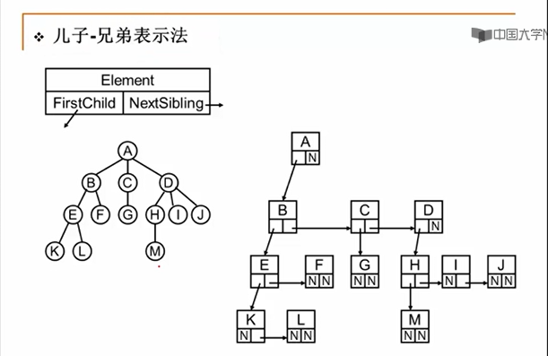

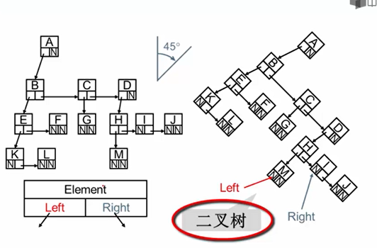

### 二叉树及存储结构

#### 几种特殊二叉树
1. 斜二叉树(实际上就是链表)
   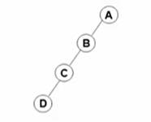
2. 完美/满二叉树
   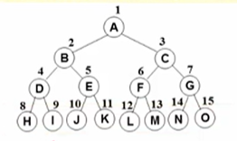
3. **完全二叉树**
   完全二叉树可以不是完美二叉树，可以缺结点，但是必须是按照一定规则（从上到下，从左到右）排序之后的尾端的连续结点序列。<br>
   比如，下面这个是完全二叉树：<br>
   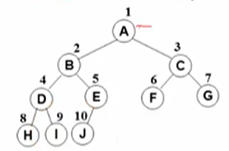
   而下面这个不是：<br>
   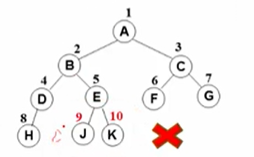
   完全二叉树是很重要的一种树。

#### 二叉树的重要性质
- 一个二叉树第i层的最大结点数为：2<sup>i-1</sup>, i $\geq$ 1
- 深度为k的二叉树有最大结点总数为2<sup>k</sup>-1, k $\geq$ 1
- 对任何非空二叉树T，若n<sub>0</sub>表示叶结点的个数,n<sub>2</sub>是度为2的非叶结点个数，那么两者满足关系n<sub>0</sub>=n<sub>2</sub>+1。

#### 二叉树顺序存储结构
对于完全二叉树（需按照上面的规则编号），可以用数组实现，而且非常方便：
- 非根结点(序号i>1)的父结点的序号是int(i/2)（向下取整—）;
- 结点(序号为i)的左孩子结点的序号是2i,(若2i<=n，否则没有左孩子) ;
- 结点(序号为i )的右孩子结点的序号是2i+1,(若2i+1<=n， 否则没有右孩子);
一般二叉树也可以这样处理，但是在没有值的位置需要把对应的位置空出来。这样会造成空间浪费

#### 二叉树链式存储结构
| Left | Data | Right |
| -- | -- | -- |

```cpp
typedef struct TreeNode *BinTree;
typedef BinTree Position;
struct TreeNode{
    ElementType Data;
    BinTree Left;
    BinTree Right;
}
```

### 二叉树的遍历
#### **二叉树的递归遍历**
1. 先序遍历
   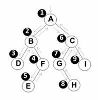
   1. 访问根结点
   2. 先序遍历其左子树
   3. 先序遍历其右子树
   ```cpp
   void PreOrderTraversal(BinTree BT)
   {
       if(BT){
           printf("%d", BT->Data);
           PreOrderTraversal(BT->Left);
           PreOrderTraversal(BT->Right);
       }
   }
   ```

2. 中序遍历
   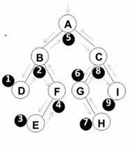
   1. 中序遍历其左子树
   2. 访问根结点
   3. 中序遍历其右子树
   ```cpp
   void InOrderTraversal(BinTree BT)
   {
       if(BT){
           InOrderTraversal(BT->Left);
           printf("%d", BT->Data);
           InOrderTraversal(BT->Right);
       }
   }
   ```
3. 后序遍历
   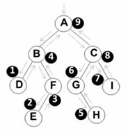
   1. 后序遍历其左子树
   2. 后序遍历其右子树
   3. 访问根结点
   ```cpp
   void PostOrderTraversal(BinTree BT)
   {
       if(BT){
           PostOrderTraversal(BT->Left);
           PostOrderTraversal(BT->Right);
           printf("%d", BT->Data);
       }
   }
   ```
#### 层序遍历
**二叉树遍历的核心问题：二维结构的线性化**
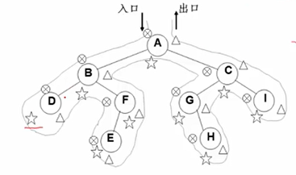
因此需要一个存储结构保存暂时不访问的结点（堆栈或者队列），否则扫描经过之后就无法访问了。

队列实现:遍历从根结点开始，首先将根结点入队，然后开始执行循环:1.结点出队、2.访问该结点、3.其左右儿子入队.

举例：对于下面的树：
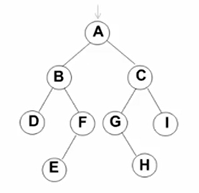<br>
有：<br>
| A    | out: <br>
| B C  | out:A<br>
| C D F | out:AB<br>
| D F G I| out:ABC<br>
| F G I E | out:ABCD<br>
| G I E H | out:ABCDF<br>
out: ABCDFGIEH<br>

代码：
```cpp
void LevelOrderTraversal ( BinTree BT )
{ Queue Q; BinTree T;
    if ( !BT ) return; /* 若是空树则直接返回 */
    Q = CreatQueue( MaxSize ); /*创建并初始化队列Q*/
    AddQ( Q, BT );
    while ( !IsEmptyQ( Q ) ) {
        T = DeleteQ( Q );
        printf(“%d\n”, T->Data); /*访问取出队列的结点*/
        if ( T->Left ) AddQ( Q, T->Left );
        if ( T->Right ) AddQ( Q, T->Right );
    }
}

```
#### 一些应用
1. 输出二叉树中的叶子结点
   只需要在二叉树遍历算法中增加检测结点的“左右子树是都否为空”即可。
   ```cpp
   void PreOrderPrintLeaves( BinTree BT )
    {
        if( BT ) {
            if ( !BT-Left && !BT->Right )
                printf(“%d”, BT->Data );
            PreOrderPrintLeaves ( BT->Left );
            PreOrderPrintLeaves ( BT->Right );
        }
    }
   ```
2. 求二叉树的高度
   假设左子树高度为HL，右子树高度为HR，则<br>
   Height=max(HL, HR)+1（根结点）
   ```cpp
   int PostOrderGetHeight( BinTree BT )
    {   int HL, HR, MaxH;
        if( BT ) {
            HL = PostOrderGetHeight(BT->Left); /*求左子树的深度*/
            HR = PostOrderGetHeight(BT->Right); /*求右子树的深度*/
            MaxH = （HL > HR）? HL : HR; /*取左右子树较大的深度*/
            return ( MaxH + 1 ); /*返回树的深度*/
        }
        else return 0; /* 空树深度为0 */
    }
   ```
3. 通过中序遍历+前序/后序遍历，唯一确定一颗二叉树

#### 判断树的同构
运用链表的思想，构造结构数组来表示下面的树：<br>
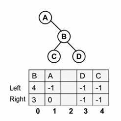<br>
```cpp
// 来学习一下怎么构造结构数组吧！
#define MaxTree 10
#define ElementType char
#define Tree int
#define Null -1

struct TreeNode
{
    ElementType Element;
    Tree Left;
    Tree Right;
}T1[MaxTree], T2[MaxTree]
```
需要完成：1.读入两个二叉树；2.二叉树同构判别<br>
输入样例：
```
### 输入样例:
8
A 1 2
B 3 4
C 5 -
D - -
E 6 -
G 7 -
F - -
H - -
8
G - 4
B 7 6
F - -
A 5 1
H - -
C 0 -
D - -
E 2 -
```
结构：
```cpp
int main()
{
    Tree R1, R2;
    R1 = BuildTree(T1); // T1，T2就是上面的结构数组，返回的是根结点的index
    R2 = BuildTree(T2);
    if(Isomorphic(R1,R2)){
        printf("Yes\n");
    }else{
        printf("No\n");
    }
    return 0;
}

Tree BuildTree( struct TreeNode T[] )
{...
    scanf("%d\n", &N);
    if (N) {
        for (i=0; i<N; i++) check[i] = 0;
        for (i=0; i<N; i++) {
            scanf("%c %c %c\n", &T[i].Element, &cl, &cr);
            if (cl != '-') {
                T[i].Left = cl-'0';
                check[T[i].Left] = 1; //原理是，如果一个元素没有指向被指向，则它就是根结点
            }
            else T[i].Left = Null;
            ... /*对cr的对应处理 */
        }
        for (i=0; i<N; i++)
            if (!check[i]) break;
        Root = i;
    }
    return Root;
}

int Isomorphic ( Tree R1, Tree R2 )
{
    if ( (R1==Null )&& (R2==Null) ) /* both empty */
        return 1;
    if ( ((R1==Null)&&(R2!=Null)) || ((R1!=Null)&&(R2==Null)) )
        return 0; /* one of them is empty */
    if ( T1[R1].Element != T2[R2].Element )
        return 0; /* roots are different */
    if ( ( T1[R1].Left == Null )&&( T2[R2].Left == Null ) )
        /* both have no left subtree */
        return Isomorphic( T1[R1].Right, T2[R2].Right );
    if ( ((T1[R1].Left!=Null)&&(T2[R2].Left!=Null))&&
        ((T1[T1[R1].Left].Element)==(T2[T2[R2].Left].Element)) )
        /* no need to swap the left and the right */
        return ( Isomorphic( T1[R1].Left, T2[R2].Left ) &&
        Isomorphic( T1[R1].Right, T2[R2].Right ) );

    else /* need to swap the left and the right */
        return ( Isomorphic( T1[R1].Left, T2[R2].Right) &&
        Isomorphic( T1[R1].Right, T2[R2].Left ) );
}
```


## 第四讲 树（中）

### 二叉搜索树(BST, Binary Search Tree)
**也成为二叉排序树和二叉查找树**

满足以下性质：
1. 非空左子树的所有键值小于其根结点的键值 （运用二分查找的思想，需要先排序）
2. 非空右子树的所有键值大于于其根结点的键值
3. 左、右子树都是二叉搜索树

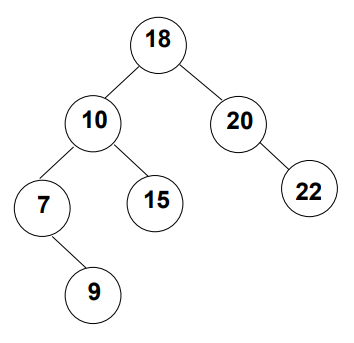

#### 查找操作：Find
- 查找从根结点开始，如果树为空，返回NULL
- 若搜索树非空，则根结点关键字和X进行比较，并进行不同处理:
  - 若X小于根结点键值，只需在左子树中继续搜索;
  - 如果X大于根结点的键值，在右子树中进行继续搜索;
  - 若两者比较结果是相等，搜索完成，返回指向此结点的指针。
  ```cpp
  1.使用尾递归的方法：
  Position Find(ElementType X, BinTree BST)
  {
      if(!BST) return NULL; //failure
      if(X>BST->Data){
          return Find(X, BST->Right); //在右子树中继续查找
      }else if(X<BST->Data){
          return Find(X, BST->Left);
      }else //X == Bst->Data{
          return BST; //查找成功，返回找到的结点的位置
      }
  }

  2.使用迭代循环的方法（推荐）：
  Position IterFind(ElementType X, BinTree BST)
  {
      while(BST){
          if(X>BST->Data){
              BST = BST->Right; //向右移动
          }else if(X<BST->Data){
              BST = BST->Left; //向左移动
          }else{
              return BST；
          }
      }return NULL;
  }
  ```
  - 若树往一边倒，比如全都只有左儿子，或者都只有右儿子，那算法效率就很低，达不到二分的log2n。因此需要平衡二叉树

#### 查找最值操作：FindMin，FindMax2
FindMin:最小值肯定在最左边
```cpp
Position FindMin(BinTree BST)
{
    // 递归方法
    if(!BST)
        return NULL;
    else if(!BST->Left)
        return BST; //找到最左边结点并返回
    else
        return FindMin(BST->Left);
}
```
FindMin:最大值肯定在最右边
```cpp
Position FindMax(BinTree BST)
{
    // 迭代方法
    if(BST){
        while(BST->Right){
            BST = BST->Right;
        }
    }return BST;
}
```
#### 插入操作
找到一个数的排序位置，并将其作为叶结点插入
```cpp
BinTree Insert(ElementType X, BinTree BST)
{
    if(!BST){
        // 若原树为空，则生成并返回一个结点的二叉搜索树
        BST = malloc(sizeof(struct TreeNode))
        BST->Data = X;
        BST->Left = BST->Right = NULL;
    }else{ //开始找插入的位置
        if(X<BST->Data)
            BST->Left = Insert(X, BST->Left);
        else if(X>BST->Data)
            BST->Right = Insert(X,BST->Right);
    }return BST;
}
```
#### 删除操作
三种情况：
1. 要删除的是叶结点：直接删除，再修改其父结点指针为NULL
2. 要删除的结点**只有一个孩子结点**：将其父结点的指针指向要删除结点的孩子结点即可，也就是直接把删除结点的子结点挂在删除结点的父结点的对应位置
3. 要删除的结点有左、右、两棵子树：用另一结点替代被删除结点--右子树的最小元素，或者左子树的最大元素（因为左子树的最大值和右子树的最小值一定不会有两个儿子，这样只需参照1和2修改即可）

```cpp
BinTree Delete( BinTree BST, ElementType X ) 
{ 
    Position Tmp; 

    if( !BST ) 
        printf("要删除的元素未找到"); 
    else {
        if( X < BST->Data ) 
            BST->Left = Delete( BST->Left, X );   /* 从左子树递归删除 */
        else if( X > BST->Data ) 
            BST->Right = Delete( BST->Right, X ); /* 从右子树递归删除 */
        else { /* BST就是要删除的结点 */
            /* 如果被删除结点有左右两个子结点 */ 
            if( BST->Left && BST->Right ) {
                /* 从右子树中找最小的元素填充删除结点，也可以左子树找最大元素 */
                Tmp = FindMin( BST->Right );
                BST->Data = Tmp->Data; //用右子树中最小元素替换被删除结点
                /* 从右子树中删除最小元素 */
                BST->Right = Delete( BST->Right, BST->Data );
            }
            else { /* 被删除结点有一个或无子结点 */
                Tmp = BST; 
                if( !BST->Left )       /* 只有右孩子或无子结点 */
                    BST = BST->Right;  //把当前结点的下一个结点桥接上来，等于删除当前结点 
                else                   /* 只有左孩子 */
                    BST = BST->Left;
                free( Tmp );
            }
        }
    }
    return BST;
}
```

### 平衡二叉树
搜索树结点不同的插入次序，将导致不同的**深度**和**平均查找长度**ASL

平衡因子（BF）：左子树和右子树的高度差<br>
BF(T) = h<sub>L</sub> - h<sub>R</sub>

平衡二叉树(Balanced Binary Tree), 或AVL树（AVL是提出的科学家的名字缩写）：<br>
- 空树，或者;
- **任 一 结 点**左、右子树的高度差绝对值不超过1，即|BF(T)| $\leq$  1<br>
  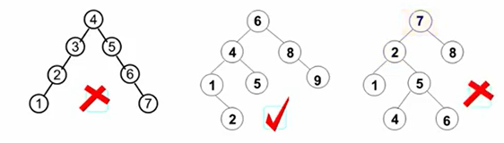
- 给定结点数为n的AVL树的最大高度为O(log<sub>2</sub>n)
  
#### 平衡二叉树的调整

分为四种情况
1. RR插入，RR旋转
   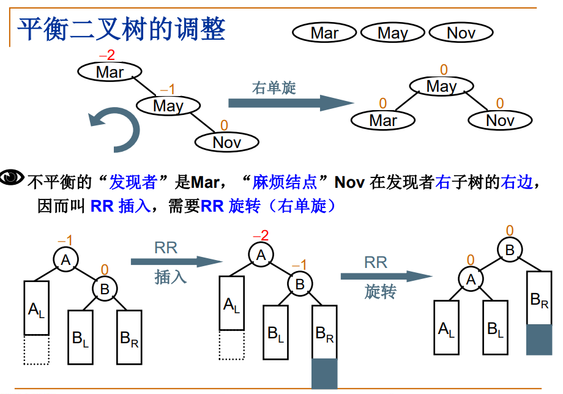
2. LL插入，LL选择
   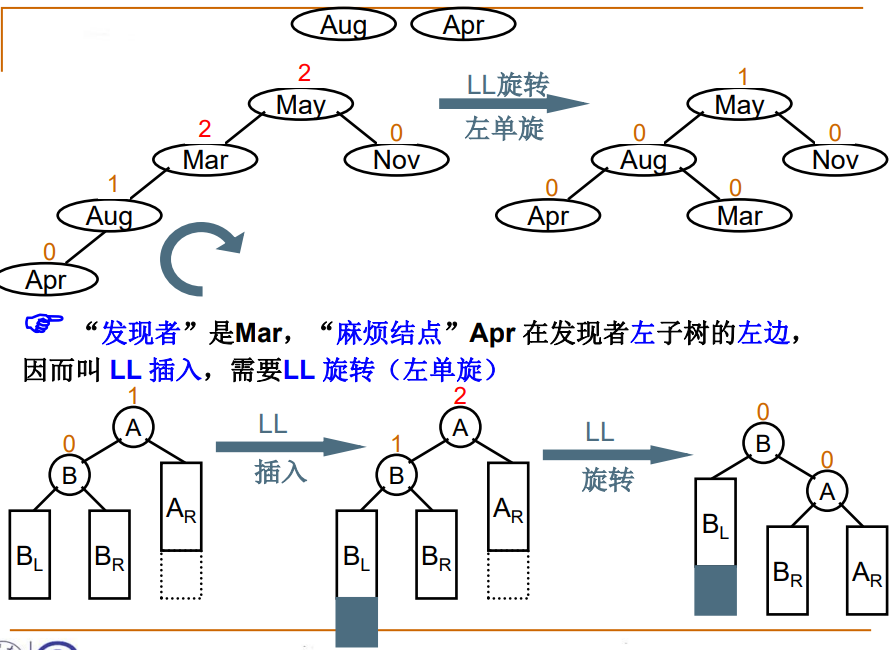
3. LR插入，LR选择
   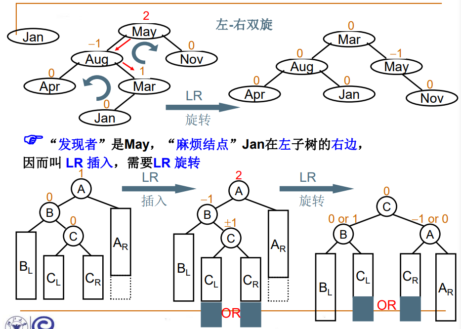
4. RL插入，RL旋转
   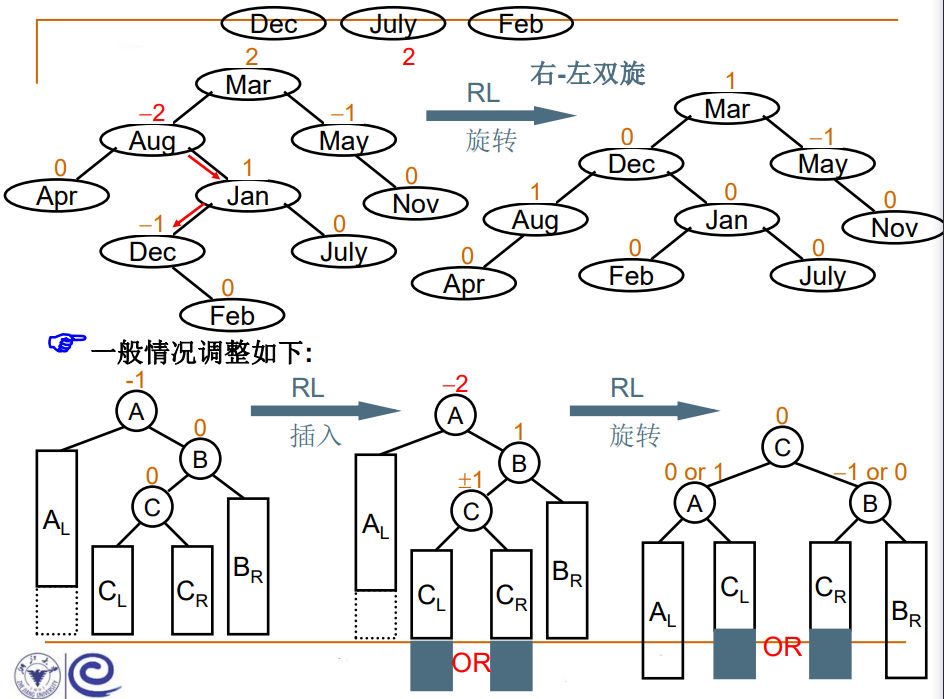


