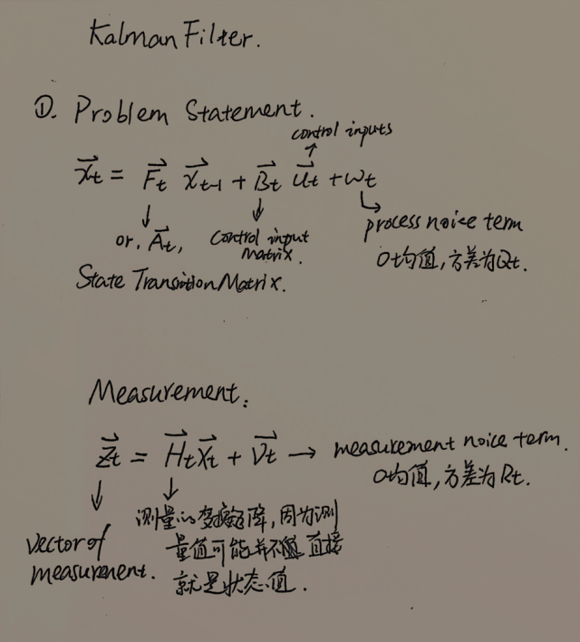
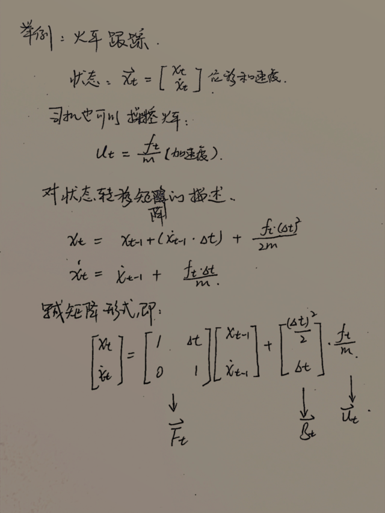
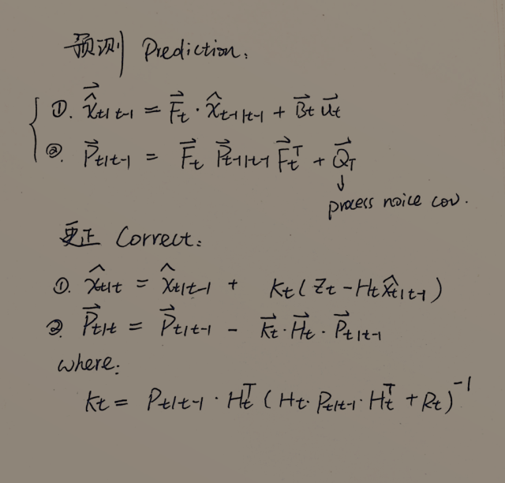

Kalman_Filter
===========================
卡尔曼滤波的基本原理和代码实现(python)。

### 通俗易懂的卡尔曼滤波推导和解释：
https://www.zhihu.com/question/23971601?sort=created

### 数学原理：
source: https://courses.engr.illinois.edu/ece420/sp2017/UnderstandingKalmanFilter.pdf






### 代码实现：
```python
class KalmanFilter(object):
	def __init__(self, dt=1,stateVariance=1,measurementVariance=1, 
														method="Velocity" ):
		super(KalmanFilter, self).__init__()
		self.method = method
		self.stateVariance = stateVariance
		self.measurementVariance = measurementVariance
		self.dt = dt
		self.initModel()
	
	"""init function to initialise the model"""
	def initModel(self): 
		if self.method == "Accerelation":
			self.U = 1
		else: 
			self.U = 0
		self.A = np.matrix( [[1 ,self.dt, 0, 0], 
				     [0 , 1 , 0 , 0], 
				     [0 , 0 , 1 , self.dt],  
				     [0 , 0 , 0 , 1]] )

		self.B = np.matrix( [[self.dt**2/2], 
				     [self.dt], 
				     [self.dt**2/2], 									
				     [self.dt]] )
		
		self.H = np.matrix( [[1,0,0,0], [0,0,1,0]] ) 
		self.P = np.matrix(self.stateVariance*np.identity(self.A.shape[0]))
		self.R = np.matrix(self.measurementVariance*np.identity(self.H.shape[0]))
		
		self.Q = np.matrix( [[self.dt**4/4 ,self.dt**3/2, 0, 0], 
				     [self.dt**3/2, self.dt**2, 0, 0], 
				     [0, 0, self.dt**4/4 ,self.dt**3/2],
				     [0, 0, self.dt**3/2,self.dt**2]])
		
		self.erroCov = self.P
		self.state = np.matrix([[0],[1],[0],[1]])


	"""Predict function which predicst next state based on previous state"""
	def predict(self):
		self.predictedState = self.A*self.state + self.B*self.U
		self.predictedErrorCov = self.A*self.erroCov*self.A.T + self.Q
		temp = np.asarray(self.predictedState)
		return temp[0], temp[2]

	"""Correct function which correct the states based on measurements"""
	def correct(self, currentMeasurement):
	       								#pinv:求广义逆
		self.kalmanGain = self.predictedErrorCov*self.H.T*np.linalg.pinv(
								self.H*self.predictedErrorCov*self.H.T+self.R)
		self.state = self.predictedState + self.kalmanGain*(currentMeasurement
								     - (self.H*self.predictedState))
		

		self.erroCov = (np.identity(self.P.shape[0]) - 
						self.kalmanGain*self.H)*self.predictedErrorCov


```
